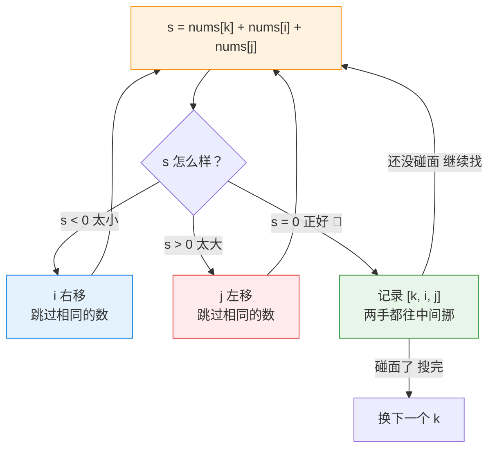

---
tags:
  - leetcode
  - 数组
  - 双指针
  - 排序
aliases:
  - 三数之和 讲解
  - 3Sum 讲解
difficulty: 中等
date: 2026-09-28
status: 已解决
---

# 15. 三数之和（3Sum）· 讲解

  -yellow?style=flat-square)

> [!info] 导航
> 📄 题目：[[三数之和-题目]] ｜ 🔗 [Krahets 原题解](https://leetcode.cn/problems/3sum/solutions/)（本篇按其思路整理扩写）

> [!abstract] TL;DR
> 一句话解法：先把数组**从小到大排队**，然后钉住第一个数，用两根指针从两头往中间找另外两个数，让三个数加起来正好等于 0。最需要小心的是：**同样的答案只能留一份**。

> [!info] 术语小卡片（后面看不懂的词，回来查这里）
> - **排序**：把数字从小到大排好队。Python 里一句 `nums.sort()` 就搞定。
> - **指针**：一个会移动的"位置编号"。`i = 0` 就是"正盯着第 0 个位置看"。
> - **双指针**：两根指针一左一右，配合着往中间移动。
> - **去重**：重复的答案只留一份。
> - **O(N²)**：描述"有多慢"的记号。数据变成 2 倍、耗时会变成 4 倍。现在只需记住：**括号里的指数越小越快**。

## 🧱 为什么暴力法不行

最笨但最好懂的办法：三层循环，把"挑三个数"的所有组合都试一遍。

本题数组最多 3000 个数，从中挑 3 个的组合有：

3000 × 2999 × 2998 ÷ 6 ≈ **45 亿种**

> [!danger] 结论
> 电脑把 45 亿种组合各算一遍，肯定超时。所以得换聪明办法：**别瞎试，让每一步都朝答案的方向走**。

## 🎯 核心思想：先排队，再两头往中间挤

### 1. 排队（排序）是一切的前提

> [!tip] 排序一口气帮了两个忙
> 1. **大小有了方向** —— 谁大谁小一目了然。总和太小就"换大点的数"，太大就"换小点的数"；
> 2. **相同的数挨在一起** —— 重复的答案会挤在一起出现，一眼就能认出来、跳过去。

### 2. 三根指针的分工

排队后，三根指针这样分工（下面是排好序的示例）：

```text
排队后:  [ -4 | -1 | -1 | 0 | 1 | 2 ]
            ↑    ↑              ↑
            k    i              j
          钉住   左手→          ←右手
       （第一个数）
```

- **`k`（队长）**：钉住不动的一个数，从左往右一个个轮。因为 i、j 都在它右边，**它一定是三个数里最小的**；
- **`i`（左手）**：从 k 右边第一个位置出发，只会往右走；
- **`j`（右手）**：从队伍末尾出发，只会往左走。

钉住 k 之后，问题就变成了："**在右边这段里找两个数，加起来正好等于 -nums[k]**"（也就是补上 k 缺的那个数）。这就是经典的"两数之和"，正是双指针最擅长的事。

### 3. 两根指针怎么动？看总和的"脸色"

每算一次总和 `s = nums[k] + nums[i] + nums[j]`，只有三种可能：

| 情况 | 说明 | 动作 |
| --- | --- | --- |
| `s < 0` | 总和太小 | 左手 `i` 右移，换个大点的数 |
| `s > 0` | 总和太大 | 右手 `j` 左移，换个小点的数 |
| `s == 0` | 正好等于 0 🎯 | 记录答案，两手同时往中间挪 |



### 4. 为什么两头往中间挤，不会漏掉答案？

> [!quote] 打个比方
> `i` 只会往右、`j` 只会往左，像**两列相向而行的火车**——中间站台上任何一对该相遇的人，它们一定会路过，不会错过。
> 再说透一点：需要变小的时候动 `i` 只会更大，需要变大的时候动 `j` 只会更小——所以每一步移动都不会帮倒忙。

## 🚧 关键细节：三道关卡

找到答案不难，难的是题目要求**同样的答案只留一份**。三道关卡就是为这件事设的。

### 关卡 1：最小的数都大于 0？后面全不用看了（`break`）

k 是三个数里最小的。连它都大于 0，说明三个数全是正数，加起来不可能是 0；而且 k 后面的数只会更大——**后面整段路都是死路**，直接收工。

> [!warning] 注意：是 `break`（全部结束），不是 `continue`（跳过一个）
> 这里不是跳过这一个 k，是**后面所有 k 都不用试了**，一步到位。

### 关卡 2：这个数和上一个一样？跳过（`continue`）

以排队后的 `[-4, -1, -1, 0, 1, 2]` 为例：

- k=1（值 -1）那一轮，已经把"以 -1 开头"的答案全找完了；
- k=2 还是 -1，再找只会得到**一模一样的答案**，所以直接跳过。

> [!bug] 容易漏的细节：`k > 0` 不能少
> 判断"和上一个一样"要看 `nums[k-1]`。当 k=0 时它前面没有数，而 Python 里 `nums[-1]` 会取到**最后一个**元素——不加 `k > 0`，程序直接出错。

### 关卡 3：找到答案后，两手都要动，还要跳过相同的数

记录答案之后，**i 和 j 必须同时动**：只动 i 总和会变大，只动 j 会变小，**都动**才可能遇到下一组。动完还要**跳过挨在一起的相同数字**，不然会记录重复答案：

```python
i += 1
while i < j and nums[i] == nums[i - 1]: i += 1   # "这个数我刚用过，再跳过一个"
```

> [!tip] 别记混：两边跳重的方向相反
> i 往右走，所以和**左边**的比（`nums[i-1]`）；j 往左走，所以和**右边**的比（`nums[j+1]`）。想想各自是从哪边走过来的就明白了。

## 📜 完整代码（逐行注释版）

```python
class Solution:
    def threeSum(self, nums: [int]) -> [[int]]:
        # ── 第 0 步：排队 ──────────────────────────────
        # 排序帮两个忙：① 知道谁大谁小，指针知道往哪边调；
        #              ② 相同的数挨在一起，重复答案容易跳过。
        nums.sort()

        res = []   # 答案都放这里
        k = 0      # 队长：钉住的第一个数（三个数里最小的）

        # k 从左往右一个个轮。上限是 len(nums) - 2，
        # 因为 k 右边至少要留出 i 和 j 两个位置。
        for k in range(len(nums) - 2):

            # ── 关卡 1：最小的数都 > 0，三个数全是正数，
            # 加起来不可能是 0。后面全部不用试了，直接收工。
            if nums[k] > 0:
                break

            # ── 关卡 2：这个数和上一个一样 → 答案会重复，跳过。
            # "k > 0" 防止 k=0 时碰到 nums[-1]（Python 里那是最后一个数！）。
            if k > 0 and nums[k] == nums[k - 1]:
                continue

            # ── 左右手就位：i 在 k 右边第一个，j 在队伍末尾。
            i = k + 1
            j = len(nums) - 1

            # 两根指针往中间走，碰面就说明这段找完了。
            while i < j:
                s = nums[k] + nums[i] + nums[j]   # 三个数的总和

                if s < 0:
                    # 总和太小 → 左手右移，换个大点的数
                    i += 1
                    # 新位置的数若和刚离开的一样，答案会重复，继续移
                    while i < j and nums[i] == nums[i - 1]:
                        i += 1

                elif s > 0:
                    # 总和太大 → 右手左移，换个小点的数
                    j -= 1
                    # 同样跳过相同的数。j 往左走，所以和右边的 nums[j+1] 比
                    while i < j and nums[j] == nums[j + 1]:
                        j -= 1

                else:
                    # 总和正好是 0！记下这组答案。
                    res.append([nums[k], nums[i], nums[j]])

                    # 两手必须同时动，否则总和永远是 0，会卡死在这里。
                    i += 1
                    j -= 1

                    # 两边都跳过相同的数，防止记录重复答案。
                    while i < j and nums[i] == nums[i - 1]:
                        i += 1
                    while i < j and nums[j] == nums[j + 1]:
                        j -= 1

        return res
```

## 🔍 手动模拟

输入 `[-1, 0, 1, 2, -1, -4]`，排队后 `[-4, -1, -1, 0, 1, 2]`（位置编号 0~5）。

| 轮次 | 钉住的数 | 结果 | 为什么 |
| --- | --- | --- | --- |
| `k=0` | -4 | 没找到 | 总和一直太小，左手走到头 |
| `k=1` | -1 | ✅ 找到 `[-1,-1,2]`、`[-1,0,1]` | 总和两次正好等于 0 |
| `k=2` | -1 | 被关卡 2 跳过 | 和上一轮的数一样 |
| `k=3` | 0 | 没找到 | 总和太大，右手退到头 |

> [!example]- 逐帧回放（点开看完整过程）
> **`k = 0`（钉住 -4）：总和一直太小，左手一路狂奔**
>
> | i | j | 总和 s | 判断 | 动作 |
> | --- | --- | --- | --- | --- |
> | 1 (-1) | 5 (2) | -3 | 太小 | i 右移；位置 2 也是 -1，跳过 → i=3 |
> | 3 (0) | 5 (2) | -2 | 太小 | i 右移 → i=4 |
> | 4 (1) | 5 (2) | -1 | 太小 | i 右移 → i=5，两手碰面，结束 |
>
> 锚点 -4 太小，谁都救不回来，一个答案没有。
>
> **`k = 1`（钉住 -1）：命中两次！**
>
> | i | j | 总和 s | 判断 | 动作 |
> | --- | --- | --- | --- | --- |
> | 2 (-1) | 5 (2) | **0** | 命中 ✅ | 记录 `[-1,-1,2]`；i→3、j→4 |
> | 3 (0) | 4 (1) | **0** | 命中 ✅ | 记录 `[-1,0,1]`；i→4、j→3，i > j 结束 |
>
> **`k = 2`（又是 -1）：被关卡 2 拦下**
>
> `nums[2] == nums[1]`，跳过。没有这一步，`[-1,-1,2]` 会被原样再记一遍。
>
> **`k = 3`（钉住 0）：总和太大，右手收缩**
>
> | i | j | 总和 s | 判断 | 动作 |
> | --- | --- | --- | --- | --- |
> | 4 (1) | 5 (2) | 3 | 太大 | j 左移 → j=4，两手碰面，结束 |
>
> k 走到 3 为止，全部结束。

> [!success] 最终结果
> `[[-1, -1, 2], [-1, 0, 1]]`，和题目预期完全一样 ✅。三道关卡在这一局里全都用上了。

## 📊 复杂度分析

- **时间 O(N²)**：k 要轮 N 次，每次 i、j 最多走 N 步——两层循环套在一起；
- **空间 O(1)**：只用了几个变量，不随数据变大而变多。

对比一下：暴力要算约 45 亿次，双指针只要约 900 万次，**快了约 500 倍**。

## 🧭 要点回顾

> [!summary] 代码里判断很多？其实就三件事
> 1. **一句移动口诀**：太小换大的、太大换小的、正好 0 就记下来且两手都动；
> 2. **两处防重**（不防就出错）：队长跳过相同的数 ＋ 找到答案后两边跳过相同的数；
> 3. **一个加速开关**（不加也不会错，只是慢）：最小的数 > 0，直接收工。

## 🔗 相关题目推荐

「两数之和 II」「最接近的三数之和」「四数之和」用的全是这一套 ==排队 + 钉一个 + 两头挤==：

- [167. 两数之和 II - 输入有序数组](https://leetcode.cn/problems/two-sum-ii-input-array-is-sorted/)：本题的简化版，建议先做它找感觉
- [16. 最接近的三数之和](https://leetcode.cn/problems/3sum-closest/)：目标从"正好 0"换成"离 target 最近"
- [18. 四数之和](https://leetcode.cn/problems/4sum/)：多钉一个数，防重逻辑原样照抄

## 📚 参考资料

- 详解来源：[Krahets 的题解](https://leetcode.cn/problems/3sum/solutions/)（力扣），本篇按其思路整理扩写
- 排版规范：[[笔记规范]]

---

⬅️ 题目见 [[三数之和-题目]]
