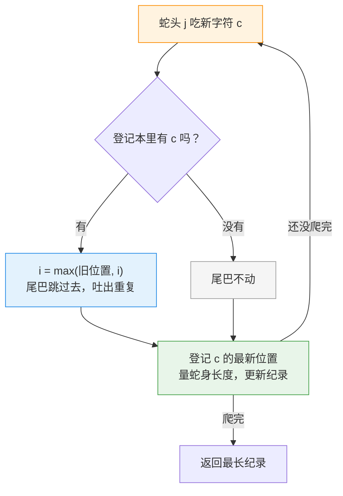

---
tags:
  - leetcode
  - 字符串
  - 哈希表
  - 滑动窗口
aliases:
  - 无重复字符的最长子串 讲解
difficulty: 中等
date: 2026-09-28
status: 已解决
---

# 3. 无重复字符的最长子串 · 讲解

  -yellow?style=flat-square)

> [!info] 导航
> 📄 题目：[[无重复字符的最长子串-题目]] ｜ 🔗 [Krahets 原题解](https://leetcode.cn/problems/longest-substring-without-repeating-characters/solutions/2361797/3-wu-zhong-fu-zi-fu-de-zui-chang-zi-chua-26i5/)（本篇按其思路整理扩写；原详解还提到动态规划解法，本文只讲滑动窗口）

> [!abstract] TL;DR
> 一句话解法：想象一条**贪吃蛇**从头到尾爬过字符串——蛇头 `j` 一个一个吃字符，一旦发现新字符**身体里已经有了**，蛇尾就缩短、把旧的吐出去。这样蛇身永远是一段**没有重复字符**的连续片段，量一量蛇身**最长时有多长**，就是答案。

> [!info] 术语小卡片（后面看不懂的词，回来查这里）
> - **子串**：字符串里**连续**的一段。`"wke"` 是 `"pwwkew"` 的子串；`"pwke"` 跳着挑的，不算。
> - **哈希表**：Python 里就是字典 `dict`，一本"登记本"——按名字（字符）一查，立刻拿到记录（上次出现的位置）。
> - **滑动窗口**：一段**会伸缩的连续区间**：右端不断前进，左端看情况收缩。本题里"窗口"就是蛇身占的那段。
> - **O(N)**：数据变成 2 倍、耗时就大约 2 倍——只走一遍、不绕路。

## 🧱 为什么暴力法不行

最笨的办法：把**所有连续片段**都列出来，逐个检查有没有重复字符。

字符串长度最大是 10 万，所有片段的数量约是：

100000 × 100001 ÷ 2 ≈ **50 亿个片段**

每个片段还要逐个字符检查有没有重复——电脑肯定算不完。

> [!danger] 结论
> 别把所有片段都列出来。聪明的做法：**只爬一遍字符串，边爬边维护"当前没有重复的一段"**，顺便量长度。

## 🎯 核心思想：贪吃蛇爬字符串

把字符串想成一局**贪吃蛇**：

```text
s:  a  b  c  a  b  c  b  b
         ┌─────────────┐
         │ i→  b  c  a │ ←j
         └─────────────┘
         蛇身 = 一段没有重复字符的片段
```

- **蛇头 `j`**：每一轮向右吃一个新字符；
- **蛇尾 `i`**：管着蛇身的左端。一旦蛇头吃到的字符**身体里已经有了**，尾巴就缩短，把**旧的那个**吐出去，蛇身恢复"没有重复"；
- **哈希表 `dic` 是座位登记本**：记下每个字符**最近一次出现的下标**。蛇头吃到重复字符时，不用一步一步挪尾巴——**翻登记本，直接跳到位**。

> [!tip] 每一轮固定做三件事
> 1. **查本**：新字符 `c` 之前出现过吗？出现过，尾巴就跳到它的旧位置（把旧的 `c` 吐出蛇身）；
> 2. **登记**：`dic[c] = j`，把 `c` 的最新位置写进登记本；
> 3. **量长度**：此刻蛇身（`i+1` 到 `j` 这段）没有重复，长度是 `j - i`，和最长纪录 `res` 比一比。



## 🚧 关键细节

### 细节 1：尾巴 `i` 从 `-1` 开始

`i` 指的是"蛇身左边**外面一格**"。一个字符都还没吃时，蛇身是空的，"外面一格"就是 -1。

这样定的好处：**数蛇身有几个字符，直接用 `j - i` 就行**，不用纠结要不要 +1、-1。

### 细节 2：`i = max(dic[s[j]], i)` —— 本题最容易踩的坑

登记本上的记录可能是**过期的**：某个字符上次出现的位置，可能在尾巴的**左边**——那个字符早就被吐出蛇身了。

这时候如果照着旧记录挪尾巴，尾巴会**往回退**，把刚吐出去的重复字符**又吞回来**！

> [!bug] 反例 `"abba"`：去掉 `max` 就翻车
> 爬到最后的 `a`（位置 3）时，登记本写着 `a: 0`，但尾巴已经在 `i = 1`——那个 `a` 早就被吐掉了（**过期记录**）。
>
> ```python
> i = max(dic[s[j]], i)   # ✅ max(0, 1) = 1，尾巴不动，蛇身 "ba" 没有重复，答案 2
> i = dic[s[j]]           # ❌ 尾巴倒退到 0！蛇身 "bba" 有两个 b，答案虚报成 3
> ```
>
> 我用代码实测过：**去掉 `max` 的版本，官方三个示例居然全部通过**，只在 `"abba"` 这类用例上悄悄给出错答案。这叫"过了样例、死在隐藏用例"，是最气人的一种错。

### 细节 3：登记本从不删旧记录

反正有 `max()` 兜底，过期记录捣不了乱——那就留着不删，代码更简单，速度也更快。

## 📜 完整代码（逐行注释版）

```python
class Solution:
    def lengthOfLongestSubstring(self, s: str) -> int:
        # ── 开局准备三样东西 ──────────────────────────
        dic = {}   # 登记本：记录每个字符"最近一次出现的下标"
        res = 0    # 最长纪录（空字符串时直接返回 0）
        i = -1     # 蛇尾：指向蛇身左边外面一格
                   # 蛇身 = 下标 i+1 到 j 这段，长度正好 = j - i

        # ── 蛇头一个一个吃字符 ────────────────────────
        for j in range(len(s)):
            # ① 查登记本：这个字符以前出现过吗？
            if s[j] in dic:
                # 出现过 → 尾巴跳到"上次出现的位置"，把旧的那个吐出去。
                # 必须用 max：旧位置如果在尾巴左边，说明是过期记录，
                # 尾巴绝不能往回退（"abba" 的最后一个 a 就是陷阱）。
                i = max(dic[s[j]], i)
            # ② 登记：把字符的最新位置写进本子（覆盖旧记录，
            # 旧记录从此过期，但无害——见 ① 的 max）。
            dic[s[j]] = j
            # ③ 量长度：现在蛇身保证没有重复，长度 j - i，
            # 和历史最长纪录比一比，谁大留谁。
            res = max(res, j - i)
        return res
```

## 🔍 手动模拟

### 先看正常局：`s = "abcabcbb"`（答案 3）

| j | 吃到的字符 | 查登记本 | i 变成 | 蛇身 | 纪录 res |
| --- | --- | --- | --- | --- | --- |
| 0 | a | 没见过 | -1 | `a` | 1 |
| 1 | b | 没见过 | -1 | `ab` | 2 |
| 2 | c | 没见过 | -1 | `abc` | 3 |
| 3 | a | 有（a:0） | 0 | `bca` | 3 |
| 4 | b | 有（b:1） | 1 | `cab` | 3 |
| 5 | c | 有（c:2） | 2 | `abc` | 3 |
| 6 | b | 有（b:4） | 4 | `cb` | 3 |
| 7 | b | 有（b:6） | 6 | `b` | 3 |

> [!example]- 逐帧讲解（点开看）
> - **j=0~2**：`a`、`b`、`c` 都是生面孔，蛇身越吃越长，纪录涨到 3；
> - **j=3（a）**：登记本写着 `a: 0`，尾巴跳到 0，旧的 `a` 被吐出，蛇身变成 `bca`——长度 3，没破纪录；
> - **j=4（b）**：`b: 1`，尾巴跳到 1，蛇身 `cab`；
> - **j=5（c）**：`c: 2`，尾巴跳到 2，蛇身 `abc`；
> - **j=6（b）**：`b: 4`，尾巴跳到 4，蛇身只剩 `cb`——连续两个 `b` 撞车，只能保住后面那个；
> - **j=7（b）**：`b: 6`，尾巴跳到 6，蛇身 `b`。
>
> 全程纪录停在 3 ✅（`"abc"` / `"bca"` / `"cab"` 都行，题目只要长度）。

### 再看陷阱局：`s = "abba"`（答案 2）

| j | 吃到的字符 | 查登记本 | 带 `max` 的 i | 不带 `max` 的 i | 蛇身 |
| --- | --- | --- | --- | --- | --- |
| 0 | a | 没见过 | -1 | -1 | `a` |
| 1 | b | 没见过 | -1 | -1 | `ab` |
| 2 | b | 有（b:1） | 1 | 1 | `b` |
| 3 | a | 有（**a:0 已过期**，0 < i=1） | **1（不动）** ✅ | **0（倒退）** ❌ | ✅ `ba` ／ ❌ `bba` 有两个 b |

结果：带 `max` 的版本答案 2 ✅；不带的版本答案 3 ❌——把不合法的 `"bba"` 也算进去了。

## 📊 复杂度分析

- **时间 O(N)**：蛇头把字符串爬一遍（N 步）；蛇尾只往前挪、从不后退，最多也挪 N 步。两根指针各走各的一趟，谁也不重复干活；
- **空间 O(1)**：本题字符总共 128 种（字母、数字、符号、空格），登记本最多 128 行，不会更多。

对比：暴力约 10^15 次运算，滑动窗口只要约 10^5 次，**快了百亿倍**。

## 🧭 要点回顾

> [!summary] 一句口诀 + 三个细节
> **口诀：头进、尾跳、量长度** —— 蛇头每轮进一个字符，尾巴查登记本直接跳到位，蛇身长度随手记最大。
>
> 1. **尾巴从 -1 起步**：长度直接 `j - i`，不用加减一；
> 2. **`max` 兜底**：过期记录不能让尾巴倒退（`"abba"` 陷阱，能骗过官方样例的那种）；
> 3. **旧记录不删**：反正 `max` 兜着，留着不碍事。

## 🔗 相关题目推荐

这是**滑动窗口**家族的第一题，"蛇头前进、查条件、蛇尾收缩"的套路一路通用。核心直觉一句话：**窗口里的情况用登记本记着，让尾巴能"跳"而不是一步步"挪"**：

- [209. 长度最小的子数组](https://leetcode.cn/problems/minimum-size-subarray-sum/)：同款双指针，条件从"没有重复"换成"加起来够大"
- [76. 最小覆盖子串](https://leetcode.cn/problems/minimum-window-substring/)：滑动窗口的天花板难题，先把本题吃透再去挑战
- [159. 至多包含两个不同字符的最长子串](https://leetcode.cn/problems/longest-substring-with-at-most-two-distinct-characters/)：登记本从"记位置"换成"记数量"，练变体

## 📚 参考资料

- 🎬 **配套动画**：同文件夹的 `滑动窗口动画.html`——双击用浏览器打开，一步一步看贪吃蛇怎么爬（先看 abba 陷阱局）
- 详解来源：[Krahets 的题解](https://leetcode.cn/problems/longest-substring-without-repeating-characters/solutions/2361797/3-wu-zhong-fu-zi-fu-de-zui-chang-zi-chua-26i5/)（力扣），本篇按其思路整理扩写；原详解另提及动态规划解法，本文未展开
- 排版规范：[[笔记规范]]

---

⬅️ 题目见 [[无重复字符的最长子串-题目]]
