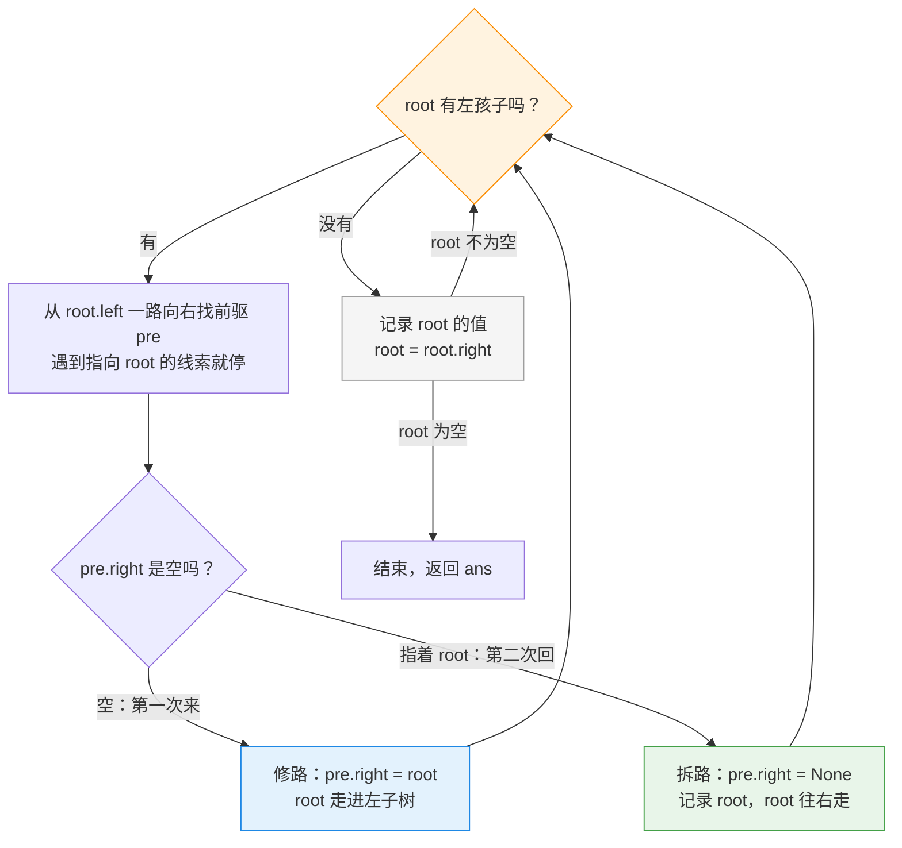

---
tags:
  - leetcode
  - 树
  - 深度优先搜索
  - 栈
  - 二叉树
aliases:
  - 二叉树的中序遍历 讲解
  - Morris 遍历 讲解
difficulty: 简单
date: 2026-09-29
status: 已解决
---

# 94. 二叉树的中序遍历 · 讲解

  -yellow?style=flat-square)

> [!info] 导航
> 📄 题目：[[二叉树的中序遍历-题目]] ｜ 🔗 [灵茶山艾府原题解](https://leetcode.cn/problems/binary-tree-inorder-traversal/solutions/)（本篇按其思路整理扩写）

> [!abstract] TL;DR
> 中序遍历 = **左 → 根 → 右**，递归三行就写完，但递归要在调用栈里记 O(h) 的"回程票"。**Morris 遍历**借用左子树最右下节点空着的右指针，立一块"回 root 的路标"（**线索**），走完再拆掉——空间降到 O(1)。最大的坑：第二次回到 root 时，找前驱必须认出线索，否则原地转圈死循环。

> [!info] 术语小卡片（后面看不懂的词，回来查这里）
> - **递归**：函数调用自己。大树的遍历拆成小树的遍历，规则不变。
> - **栈**："后进先出"的记事本。函数每往下调一层，就在这里留一张"回程票"。
> - **h（树高）**：树最深的层数。`O(h)` 就是"和层数成正比"。
> - **前驱**：按中序顺序排在 root **前面**的那个节点（root 的"上一个"）。
> - **线索**：借用树里空着的右指针，临时记一条"回到某节点"的路。
> - **Morris 遍历**：用线索代替栈的中序遍历，空间 O(1)。

## 🧱 一、先把它做出来：递归版，三行核心

中序的规则"左 → 根 → 右"翻译成代码，就是三行，顺序都不用改：

```python
class Solution:
    def inorderTraversal(self, root: Optional[TreeNode]) -> List[int]:
        def dfs(node: Optional[TreeNode]) -> None:
            if node is None:        # 空树/走到头：什么都不做
                return
            dfs(node.left)          # 左：先把左子树全走完
            ans.append(node.val)    # 根：轮到自己，收进答案
            dfs(node.right)         # 右：再去走右子树

        ans = []
        dfs(root)
        return ans
```

### 递归版的语法拆解（刚学 Python 看这里）

1. **函数里还能再定义函数**：`dfs` 定义在 `inorderTraversal` 内部，是它私有的小工具，外面的代码看不见它。题目只要一个小工具，就不必把它暴露给全世界。
2. **`ans` 写在 `def dfs` 后面，dfs 却能用**：`def` 只是"登记做法"，不执行。真正执行 `dfs(root)` 时，`ans = []` 早就跑过了。Python 找变量的顺序：**先翻自己口袋（dfs 内部）→ 再翻外套口袋（外层函数）→ 再翻家里抽屉（全局）**，`ans` 在第二层找到。这个现象叫**闭包**。
3. **`node: Optional[TreeNode]`、`-> None` 都是标签**：写给人和编辑器看的类型说明，运行时不检查。`Optional[TreeNode]` 读作"TreeNode **或** None"（空位置用 None 表示）；`-> None` 表示不返回值；`-> List[int]` 表示返回整数列表。
4. **`is None` 和光杆 `return`**：`is None` 是判断"是不是空值本身"的惯用写法；只写 `return` 等于 `return None`，作用是"这层到此为止，退回上一层"。
5. **`dfs` 没有 `self`**：`self` 只属于类的方法；`dfs` 是住在方法里的普通函数，所以没有。

```text
dfs(2)                       ← 第 1 层
├─ dfs(2.left = 1)           ← 第 2 层
│   ├─ dfs(None)             → 光杆 return，立刻回第 2 层
│   ├─ ans.append(1)         → [1]
│   └─ dfs(None)             → return
├─ ans.append(2)             → [1, 2]
└─ dfs(2.right = 3)
    └─ ans.append(3)         → [1, 2, 3]
结束，return ans
```

> [!tip] 缩进越深 = 调用栈里的"回程票"越多
> 这张梯形图就是 O(h) 空间的可视化：树有多高，同时叠着的 dfs 就有多少层。

### 从伪代码到 Python：翻译表

| 伪代码速记 | Python 正确写法 | 差在哪 |
| --- | --- | --- |
| `dfs(node:)->none:` | `def dfs(node) -> None:` | 少 `def`；`None` 大写 |
| `if node -> none:` | `if node is None:` | 箭头改 `is`；`None` 大写 |
| `dfs(node,left)` | `dfs(node.left)` | 逗号改点号（取成员） |
| `res.append()` | `res.append(node.val)` | 括号里放要装的值 |
| `res[]` | `res = []` | 建列表用赋值号 |
| `dfs(target)` | `dfs(root)` | 名字和入口参数一致 |

> [!warning] C 语言残留：箭头 `->`
> C 里"取成员"写 `node->left`，Python 里一律用**点**（`node.left`）；箭头在 Python 只有一个岗位——函数签名末尾标返回类型（`def dfs(node) -> None:`）。空值写 `None`（大写），判断用 `is None`。
> 记忆钩子：**箭头归函数签名，点号归节点成员，空值是 None 用 is。**

> [!tip] 这三行会"变形"
> 把"收进答案"那行**移到最前**就是前序遍历（根左右），**移到最后**就是后序遍历（左右根）。三种遍历共用一副骨架，只挪一行。

> [!danger] 它唯一的代价：要记路
> 递归往下走时，每一层都在调用栈里留一张"回程票"。树有多高（h 层），票就有多少张——**空间 O(h)**。最坏情况：树歪成一条线，h = n，票就是 n 张。
> 题目的进阶问的就是：**能不能连票都不用？** 不能递归，也不能用栈模拟递归。

## 🎯 二、Morris 遍历：不记路，先修路

递归省不掉的，是"去了左子树之后，怎么回 root"。

> [!tip] Morris 的办法：去之前，先把回家的门修好
> 观察一棵树：左子树里**最右下**的那个节点（中序里 root 的"上一个"，叫**前驱**），它的右指针天生是空的——正好拿来当路标。
> 下左子树之前，把它的右指针指向 root（立一块**线索**："此路通向 root"）；走完左子树，会撞见这块路标，顺它回到 root，就知道左子树干完了——**拆掉路标**（恢复原样），记录 root，往右走。

前驱怎么找？从 `root.left` 出发，**一直往右走，走到头**：

```text
        root
       /
      ...          ← root 的左子树
       \
        pre        ← 一直往右走到头的就是它，pre.right 空着
```



每个节点都会被 root 停留**两次**：第一次路过（修路下左），第二次从线索回来（拆路记录、去右边）。"记录答案"只发生在第二次——这正是中序"左完成，才轮到根"。

## 🚧 关键细节

### 细节 1：找前驱的循环必须认得线索

```python
while pre.right and pre.right is not root:
    pre = pre.right
```

`pre.right is not root` 这半句不能少：第二次回到 root 时，前驱的 right 已经指着 root 了。不认出这块路标，就会顺着它又绕回 root，**死循环**。

### 细节 2：`pre.right` 的两种状态，就是"第一次来 / 第二次回"

- `pre.right` 为空 → 第一次路过：修路，进左子树；
- `pre.right` 指着 root → 第二次回来：拆路，记录，往右。

一个判断，天然区分两个阶段——这就是 Morris 不用栈的全部秘密。

### 细节 3：`root = root.right` 一句话两个意思

右子树存在，它就是"进入右子树"；不存在，它就是"顺着线索回到上层 root"。一个动作，两种含义。

> [!bug] 拆线索这行是"礼貌"，也是"正确性"
> 详解里说：如果遍历完这棵树就扔，`pre.right = None` 可以省。我实测过：**拆了线索，对同一棵树跑第二遍 Morris 结果完全一致**（树确实恢复原样）；不拆的话树就被永久改坏了。做题建议保留。

## 📜 完整代码（逐行注释版）

**版本一：递归（先保证会做）**

```python
class Solution:
    def inorderTraversal(self, root: Optional[TreeNode]) -> List[int]:
        def dfs(node: Optional[TreeNode]) -> None:
            if node is None:        # 树是空的（或走到底了）：直接返回
                return
            dfs(node.left)          # 左：整棵左子树都走完才回来
            ans.append(node.val)    # 根：这时才轮到自己
            dfs(node.right)         # 右：最后走右子树

        ans = []                    # 答案数组
        dfs(root)                   # 从根开始走
        return ans
```

**版本二：Morris（进阶，O(1) 空间）**

```python
class Solution:
    def inorderTraversal(self, root: Optional[TreeNode]) -> List[int]:
        ans = []

        while root:                     # root 走到 None 就全走完了
            if root.left:
                # 找前驱 pre：中序里 root 的"上一个"。
                # 从左孩子出发一路向右；遇到指向 root 的线索就停（细节 1）。
                pre = root.left
                while pre.right and pre.right is not root:
                    pre = pre.right

                if pre.right is None:
                    # 空的 → 第一次来：修路 + 下左子树
                    pre.right = root    # 立线索：pre 的右边通向 root
                    root = root.left    # 走进左子树
                    continue            # 重新问一遍"root 有左孩子吗"

                # 指着 root → 第二次回来：拆路（恢复原树）
                pre.right = None

            # 走到这里：root 的左子树必然处理完了
            ans.append(root.val)        # 记录当前值（中序的"根"）
            root = root.right           # 进右子树；没有右子树就顺线索回上层

        return ans
```

## 🔍 手动模拟

用这棵最短的树，一次看全"修路 → 顺路回家 → 拆路"：

```text
    2
   / \
  1   3
```

| 步 | root | 发生了什么 | 线索 | ans |
| --- | --- | --- | --- | --- |
| 1 | 2 | 2 有左孩子 → 找前驱：从 1 出发往右走，1 没有右孩子，前驱就是 1；`1.right` 为空 → **修路** `1.right = 2`，root 走向 1 | 1→2 | `[]` |
| 2 | 1 | 1 没有左孩子 → 记录 **1**；`root = root.right`，**顺着线索回到 2** | 1→2 | `[1]` |
| 3 | 2 | 2 又有左孩子 → 找前驱：从 1 出发，`1.right` 正指着 2，停；不是空 → **第二次回来**：拆线索（`1.right = None`），记录 **2**，root 走向 3 | （无） | `[1,2]` |
| 4 | 3 | 3 没有左孩子 → 记录 **3**；`root = root.right = None` | （无） | `[1,2,3]` |
| 5 | None | 循环结束 | — | `[1,2,3]` ✅ |

> [!success] 实测结果
> 我用代码跑了三棵树（例 1 `[1,null,2,3]`、上面的模拟树、一棵六节点树），递归和 Morris 的输出**完全一致**；对同一棵树连跑两遍 Morris 结果也不变——线索确实拆干净了，树恢复原样。官方示例 `[1,null,2,3] → [1,3,2]` 两个版本都通过。

## 📊 复杂度分析

**递归版**

- 时间 O(n)：每个节点进函数一次；
- 空间 O(h)：树有几层，调用栈里就有几张"回程票"。

**Morris 版**

- 时间 O(n)：看着是两层循环，但每条边最多被踩**三次**（找前驱、下左子树、第二次找前驱）；树只有 n−1 条边，总量还是 O(n)；
- 空间 O(1)：线索借的是树里**本来就空着**的指针，一个新格子都没开（返回值不算）。

对比：递归 100 个节点的歪树要记 100 张票；Morris 一张都不记。

## 🧭 要点回顾

> [!summary] 一句口诀 + 三个细节
> **口诀：一次来，修路进左；二次回，拆路记根。**
>
> 1. 找前驱的 while 必须带 `pre.right is not root`——不认线索就死循环；
> 2. `root = root.right` 一句话两个意思（进右子树 / 顺线索回家），这是省掉栈的全部秘密；
> 3. 拆线索既礼貌又必要——不拆，树就被永久改坏了。

**模板价值**：把"修路"和"记录"的时机一挪，同一套 Morris 就能做**前序**（第一次路过就记录）和**后序**（变体）；而"中序 = 升序"这个性质，在二叉搜索树的题里是万能钥匙。

## 🔗 相关题目推荐

- [144. 二叉树的前序遍历](https://leetcode.cn/problems/binary-tree-preorder-traversal/)：详解指定的练习，用 Morris 变体做一遍
- [145. 二叉树的后序遍历](https://leetcode.cn/problems/binary-tree-postorder-traversal/)：同上，Morris 后序是三者中最绕的
- [98. 验证二叉搜索树](https://leetcode.cn/problems/validate-binary-search-tree/)：延伸——"中序 = 升序"的经典应用

## 📚 参考资料

- 详解来源：[灵茶山艾府的题解](https://leetcode.cn/problems/binary-tree-inorder-traversal/solutions/)（力扣），本篇按其思路整理扩写
- 排版规范：[[笔记规范]]

---

⬅️ 题目见 [[二叉树的中序遍历-题目]]
