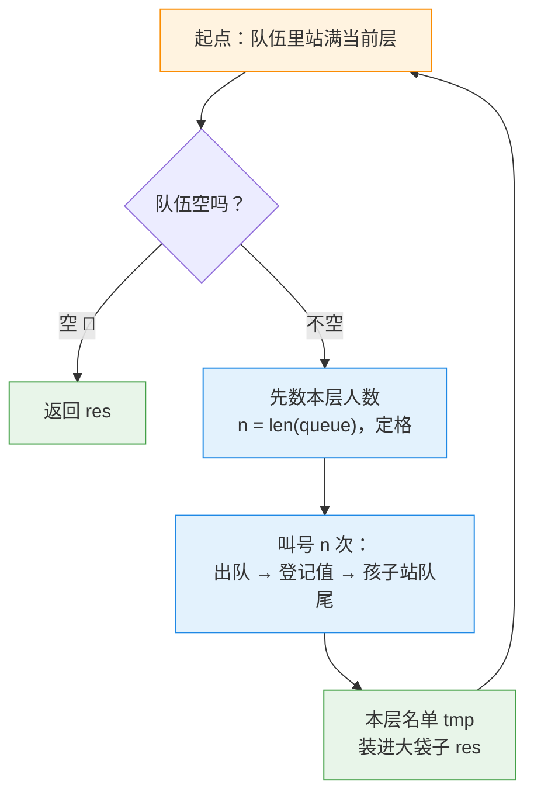

---
tags:
  - leetcode
  - 树
  - 广度优先搜索
  - 二叉树
  - 队列
aliases:
  - 二叉树的层序遍历 讲解
  - Binary Tree Level Order Traversal 讲解
difficulty: 中等
date: 2026-09-29
status: 已解决
---

# 102. 二叉树的层序遍历 · 讲解

  -yellow?style=flat-square)

> [!info] 导航
> 📄 题目：[[二叉树的层序遍历-题目]] ｜ 🔗 [详解：Krahets（力扣）](https://leetcode.cn/problems/binary-tree-level-order-traversal/solutions/2361604/102-er-cha-shu-de-ceng-xu-bian-li-yan-du-dyf7/)

> [!abstract] TL;DR
> 层序遍历 = **广度优先搜索（BFS）**，用**队列**实现。每轮开打前**先数清本层几人**（`n = len(queue)` 开轮定格），然后只叫这么多个号：队头出队、登记进本层名单、把孩子领来站队尾。一轮一层，队空收工。最大的坑：内层循环要是写成"队有多长叫多长"，一层就炖成一锅（实测复现）。

> [!info] 术语小卡片（后面看不懂的词，回来查这里）
> - **广度优先搜索（BFS）**：像水波纹一圈圈扩散，**一层扫完才下一层**；对比深度优先（DFS）"一根筋扎到底再回头"。
> - **队列（queue）**：排队的队伍，**先来先走**（先入先出）。
> - **deque**：Python 的"双头队伍"，队头出队 `popleft()` 一步到位；普通列表 `pop(0)` 要全队搬家。
> - **出队 / 入队**：叫号（队头走人）/ 排队（新人站队尾）。

## 🧱 一、为什么递归四招不直接好使

[[二叉树的中序遍历-讲解|94]]、[[二叉树的最大深度-讲解|104]]、[[翻转二叉树-讲解|226]]、[[对称二叉树-讲解|101]] 四招全是**深度优先**：访问顺序是 `3 → 9 → 15 → 7 → 20`（扎到底、回头、换一支）。

本题要的是按辈分**分组**输出 `[[3],[9,20],[15,7]]`——你要的是"全村按辈分点名"，不是"顺着血脉一路走到底"。访问顺序对不上，硬凑就得打满补丁。

> [!danger] 结论
> 深度优先的顺序天生和层序错位。想"一层一层来"，就换专门干这个的工具：**队列**。
>
> （题意阶段的钩子一其实是一条暗线：104 的"带层下楼登记"补上层号也能做出同样输出——递归版合法。但队列 BFS 是层序家族的**正宗模板**，学会一路通吃，见文末相关题目。）

## 🎯 二、核心思想：食堂打饭，一轮一层

题意阶段留的钩子二在这里揭晓：**怎么拿到下一层的名单？——不用你拿，上一层排队的人自己把孩子领来排队。**

食堂规矩一共五条：

1. 开局：第一代 `root` 先来排队；
2. 开饭前**先数清这一队几人**（`n = len(queue)`）；
3. 只叫 `n` 个号：队头出队 → 登记进本层名单 `tmp` → 把自己的孩子领来站**队尾**；
4. 一轮结束，队里**恰好只剩下一层的人**——自然过渡到下一轮；
5. 队伍空了，收工。

```text
开局    队伍 [3]             ← 第 0 层
第 1 轮  叫 3，孩子入队       队伍 [9, 20]   ← 正好是第 1 层
第 2 轮  叫 9、20，孩子入队   队伍 [15, 7]   ← 正好是第 2 层
第 3 轮  叫 15、7，没孩子     队伍 []        ← 队空收工
```

> [!tip] 口诀
> **空树先挡，队伍起步；先数后叫，孩子站尾；一轮一层，队空收工。**



## 🚧 三、关键细节（每个坑都实测过）

### 细节 1：先数后叫——`n = len(queue)` 定格

代码先把**开轮时**的队伍人数存进普通变量 `n`，再用 `for i in range(n)` 只叫 n 个号。循环里孩子不断站队尾、队伍越排越长，但 `n` 就是个普通数字——赋值那一刻是多少就永远是多少。这就是"分层"的全部秘密。

> [!bug] 实测：内层写成 `while queue`（队有多长叫多长）
> 孩子边叫边来，永远叫不完，直到全树叫光——输出 `[[3, 9, 20, 15, 7]]`，一锅炖，没有分层。我在示例 1 上跑过，就是这么错的。

### 细节 2：每层发新袋子——`tmp = []` 写在 while 里面

`tmp` 建在 while 里，每层换一个新袋子。建在外面，所有层共用一袋，`res` 里塞进去三次的是**同一个袋子**。

> [!warning] Python 小知识：变量存的是"袋子地址"，不是袋子本身
> `res.append(tmp)` 塞的是这袋子的位置，不是复印件。同一个地址塞三格，改一个全变。实测：错误版输出 `[[3, 9, 20, 15, 7], [3, 9, 20, 15, 7], [3, 9, 20, 15, 7]]`，且 `res[0] is res[1] is res[2]` 为 `True`——三袋确是同一袋。

### 细节 3：出队用 `deque.popleft()`，别用 `list.pop(0)`

普通列表 `pop(0)`：队头走人，**身后所有人前挪一步**（全队搬家），队伍越长越慢。`deque` 是双头队伍，`popleft()` 只动队头，永远一步到位。

> [!success] 实测：出队 5 万次
> `deque.popleft()` 用 **0.0013 秒**；`list.pop(0)` 用 **0.1755 秒**——慢约 **139 倍**。本题 N ≤ 2000 两者都能过，但 BFS 模板要一次到位，养成 `deque` 习惯。

### 细节 4：空树特判 + 孩子先验货再发号

`if not root: return []`——没人排队，大袋子空着回（注意不是 `[[]]`）。孩子入队前必须 `if node.left` 验货：`None` 不是节点，不能发号，否则下一轮 `node.val` 直接撞墙。

> [!bug] 实测：去掉判空
> 拿只有 1 个节点的树跑，第二轮出队 `None`，当场报错 `AttributeError: 'NoneType' object has no attribute 'val'`。

## 📜 四、完整代码（新手版 · 逐行注释）

```python
import collections                      # 力扣环境其实自带，写上哪里都能跑

class Solution:
    def levelOrder(self, root: Optional[TreeNode]) -> List[List[int]]:
        # ── 特例处理：空树 ─────────────────────────────
        if root is None:                # 刹车：一颗树都没有，没人排队
            return []                   # 大袋子空着回（不是 [[]]）

        # ── 初始化：队伍 + 大袋子 ──────────────────────
        res = []                        # 大袋子：最终答案，一层一小袋
        queue = collections.deque()     # 双头队伍：队头出、队尾进
        queue.append(root)              # 第一代 root 先来排队

        # ── BFS 主循环：一轮 = 一层 ────────────────────
        # 题解原文写 while queue:，意思一样——"队伍非空就继续"
        while len(queue) > 0:           # 队里还有人，就还有下一层
            tmp = []                    # 本层名单：每层发新袋子（细节 2）
            n = len(queue)              # 关键一步：把本层人数定格存进 n（细节 1）
            for i in range(n):          # 只叫 n 个号；i 只用来数次数，不干别的活
                node = queue.popleft()  # 叫号：队头出队，一步到位（细节 3）
                tmp.append(node.val)    # 登记：把名字写进本层名单
                if node.left is not None:      # 验货：真有左孩子才发号（细节 4）
                    queue.append(node.left)    # 孩子站队尾，等下一轮
                if node.right is not None:     # 右孩子同理
                    queue.append(node.right)
            res.append(tmp)             # 本层名单装进大袋子

        return res                      # 队空收工，交出按层分好的答案
```

原详解的写法偏简练，上面这份换成了新手版：**逻辑一模一样，只改说法**，改写后 5 个测试用例全部实跑通过 ✅。以后在别的题解里见到下面这些"优雅写法"，按这张表翻译就行：

> [!info] 优雅版 vs 新手版对照表
>
> | 详解常见优雅写法 | 本篇新手写法 | 意思 |
> | --- | --- | --- |
> | `if not root: return []` | `if root is None:` 单独一行，再 `return []` | 空树就直接返回 |
> | `res, queue = [], deque()` | 拆成两行，各建各的 | 分开声明两个变量 |
> | `while queue:` | `while len(queue) > 0:` | 队伍里还有人就继续循环 |
> | `if node.left:` | `if node.left is not None:` | 真有左孩子才发号 |
> | `for _ in range(n)` | `for i in range(n)` | 循环 n 次；`_` 和 `i` 都只是计数 |

## 🔍 五、手动模拟

示例 1 `[3,9,20,null,null,15,7]`，三轮总览：

| 轮次 | 开轮队伍（定格） | 叫号 | 孩子入队后 | 本层袋子 |
| --- | --- | --- | --- | --- |
| 1 | `[3]` | 3 | `[9, 20]` | `[3]` |
| 2 | `[9, 20]` | 9、20 | `[15, 7]` | `[9, 20]` |
| 3 | `[15, 7]` | 15、7 | `[]` | `[15, 7]` |
| 收工 | `[]` | — | — | `res = [[3],[9,20],[15,7]]` |

> [!example]- 逐帧回放（点开看完整过程）
>
> | 帧 | 动作 | 队伍 queue | 本层 tmp | res |
> | --- | --- | --- | --- | --- |
> | 0 | 起步：root 入队；`len(queue)=1` **定格 n=1** | `[3]` | `[]` | `[]` |
> | 1 | 叫 3 → tmp 记 3；孩子 9、20 站队尾（队伍变长但 n 仍=1，本轮只叫 1 人） | `[9, 20]` | `[3]` | `[]` |
> | 2 | 本轮叫满，`[3]` 装袋；换新袋子；`len=2` 定格 n=2 | `[9, 20]` | `[]` | `[[3]]` |
> | 3 | 叫 9 → tmp 记 9；9 没孩子 | `[20]` | `[9]` | `[[3]]` |
> | 4 | 叫 20 → tmp 记 20；孩子 15、7 入队（本轮叫满 2 人） | `[15, 7]` | `[9, 20]` | `[[3]]` |
> | 5 | `[9,20]` 装袋；`len=2` 定格 n=2 | `[15, 7]` | `[]` | `[[3], [9, 20]]` |
> | 6 | 叫 15 → tmp 记 15；没孩子 | `[7]` | `[15]` | `[[3], [9, 20]]` |
> | 7 | 叫 7 → tmp 记 7；没孩子 | `[]` | `[15, 7]` | `[[3], [9, 20]]` |
> | 8 | `[15,7]` 装袋；`while` 检查：队伍空 → 跳出 | `[]` | `[]` | `[[3], [9, 20], [15, 7]]` |
> | 9 | `return res` ✅ | — | — | — |
>
> 注意帧 1：孩子 9、20 已在队里，但 n 在帧 0 定格过——**他们这轮不被叫**，这正是分层的机关。

> [!success] 实测结果
> 官方 3 个示例 + 自定义 2 个用例全部通过 ✅
>
> | 输入 | 输出 | 预期 |
> | --- | --- | --- |
> | `[3,9,20,null,null,15,7]` | `[[3],[9,20],[15,7]]` | 一致 ✅ |
> | `[1]` | `[[1]]` | 一致 ✅ |
> | `[]` | `[]` | 一致 ✅ |
> | `[1,2,3,4,5,null,6]`（题意自测树） | `[[1],[2,3],[4,5,6]]` | 一致 ✅ |
> | `[1,null,2,null,3]`（右拐链） | `[[1],[2],[3]]` | 一致 ✅ |

## 📊 六、复杂度分析

- **时间 O(N)**：每个节点入队一次、出队一次、登记一次——一人一趟手续，N 个人合计 N 趟；
- **空间 O(N)**：队伍最长的时候是最"胖"的那层——平衡二叉树最底层能站下约一半人（N/2）；
- 和递归四招同阶，**没多花钱，只是换了访问顺序**。

## 🧭 要点回顾

> [!summary] 一句口诀 + 三个细节
> **口诀：空树先挡，队伍起步；先数后叫，孩子站尾；一轮一层，队空收工。**
> 1. `n = len(queue)` **开轮定格**是分层的全部秘密——错成 `while queue` 就一锅炖（实测输出 `[[3,9,20,15,7]]`）；
> 2. `tmp` 每层**发新袋子**，`deque.popleft()` **一步到位**（`pop(0)` 实测慢 139 倍）；
> 3. 空树回 `[]`、孩子先验货——两个"第一次"的坑都堵住。

题意阶段两个钩子在此收线：钩子一"带层下楼登记"是递归侧的合法答案；钩子二"怎么拿到下一层名单"——答案是**根本不用拿**，排队的人自己把孩子领来站队尾。

## 🔗 相关题目推荐

- [107. 层序遍历 II](https://leetcode.cn/problems/binary-tree-level-order-traversal-ii/)：本题结果整个上下翻转——收工后 `res.reverse()` 一行的事
- [199. 二叉树的右视图](https://leetcode.cn/problems/binary-tree-right-side-view/)：每层袋子只要**最后一个**
- [637. 二叉树的层平均值](https://leetcode.cn/problems/average-of-levels-in-binary-tree/)：每层袋子**求平均**——三道全是本题换皮
- [543. 二叉树的直径](https://leetcode.cn/problems/diameter-of-binary-tree/)：回到深度优先，104"自底向上"的变体，推荐的下一站

## 📚 参考资料

- [102. 二叉树的层序遍历题解 · Krahets（力扣）](https://leetcode.cn/problems/binary-tree-level-order-traversal/solutions/2361604/102-er-cha-shu-de-ceng-xu-bian-li-yan-du-dyf7/)——本篇讲解的骨架来源，坑点复现与计时为原创实测
- 排版规范：[[笔记规范]]

---

⬅️ 题目见 [[二叉树的层序遍历-题目]]
