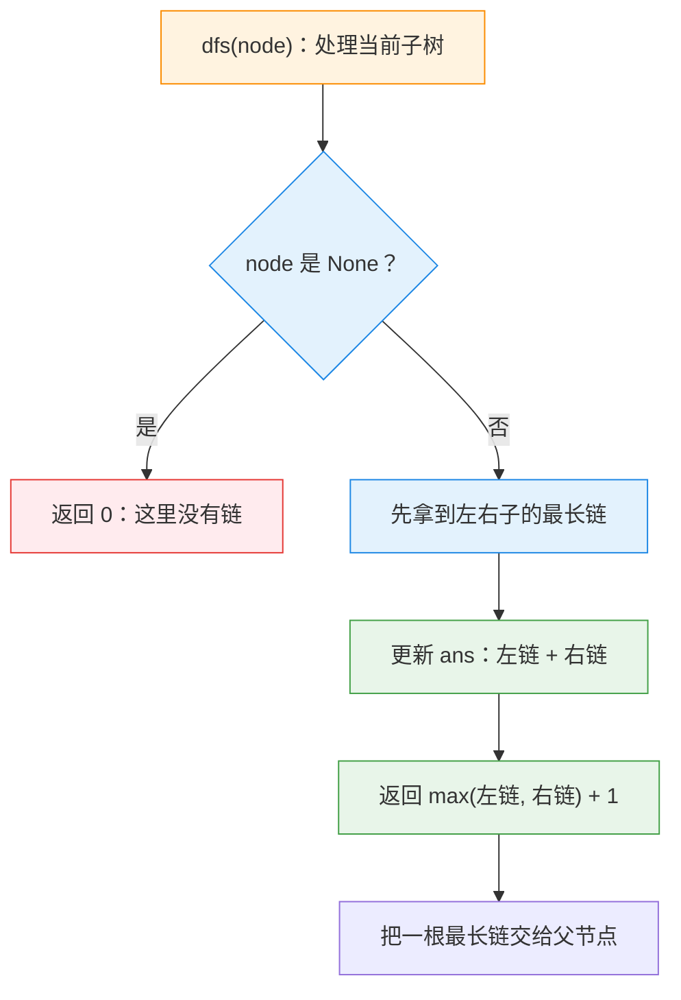

---
tags:
  - leetcode
  - 树
  - 深度优先搜索
  - 二叉树
  - 树形动态规划
aliases:
  - Diameter of Binary Tree 讲解
  - 二叉树的直径 讲解
difficulty: 简单
date: 2026-09-29
status: 已解决
---

# 543. 二叉树的直径 · 讲解

  -yellow?style=flat-square)

> [!info] 导航
> 📄 题目：[[二叉树的直径-题目]] ｜ 🔗 [灵茶山艾府原题解](https://leetcode.cn/problems/diameter-of-binary-tree/solutions/2227017/shi-pin-che-di-zhang-wo-zhi-jing-dpcong-taqma/)（本篇按其思路整理扩写）

> [!abstract] TL;DR
> 对每个节点，**向左右子树各要一条最长链**，把两条链拼起来，就是“在这里拐弯”的最长路径；用全局 `ans` 记录所有拐弯点中的最大值。`dfs(node)` 只返回**子树里最长的一条链**，不是已经拐过弯的直径。时间和空间分别是 **O(n) / O(h)**；最大的坑就是把“直径”当成返回值继续向上拼。

> [!info] 术语小卡片（后面看不懂的词，回来查这里）
> - **链**：从一个节点往下走到某个后代的一条连续道路。叶子到自己的链长是 0。
> - **子树**：把某个节点当成小根节点，它和它下面所有后代组成的一棵小树。
> - **直径**：树里任意两个节点之间最长路径的长度，路径长度按**边数**计算。
> - **深度优先搜索（DFS）**：沿着一条路一直往下走，走到尽头再回头；这里用递归实现。
> - **树形动态规划（树形 DP）**：先把左右子树的答案算好，再用它们组装当前节点的答案。
> - **后序遍历**：顺序是“左子树 → 右子树 → 当前节点”，正好符合“先拿孩子答案再算自己”的需求。
> - **`nonlocal`**：内层函数要重新赋值外层函数的变量时，必须提前声明“我改的是外面那个变量”。

## 🧱 一、为什么暴力枚举不行

最直接的想法是枚举任意两个节点，再找它们之间的路径，最后取最长的一条。

节点数最多约 `10^4`。如果只看“选哪两个节点”，大约有：

```text
10000 × 9999 ÷ 2 ≈ 49,995,000（约 5000 万）对
```

每一对还要从树里找路径，很多边会被反复走。这样不仅写起来麻烦，时间也会远远超过一次遍历。

> [!danger] 暴力法的问题
> 同一棵子树会被不同节点对反复检查。树形 DP 的价值就在于：**每棵子树只算一次，再把结果往上传**。

## 🎯 二、核心思想：每个节点都可能是“拐弯点”

先看一棵树。假设某条最长路径在节点 `2` 处拐弯：

```text
        1
       / \
      2   3
     / \
    4   5
```

路径 `4 → 2 → 5` 由两条从 `2` 往下走的链拼成：

```text
左边一条链：2 → 4，长度 1
右边一条链：2 → 5，长度 1
拼到一起：4 → 2 → 5，长度 1 + 1 = 2
```

把每个节点都想成一个小队长：

1. 左子树队长交上来“从我这棵树往下走，最长的一条链”；
2. 右子树队长也交上来一条最长链；
3. 当前队长把左右两条链拼起来，形成一条经过自己的候选路径；
4. 当前队长再把**较长的一条链**交给自己的父节点。

为什么只交一条？因为路径继续往父节点走时，只能选左边或右边其中一条，不能把两条链同时带上去。



> [!tip] 一句话记住两个值
> `dfs` 的返回值是**能继续向上的链**；`ans` 才是**已经拼成的直径**。一个负责“继续走”，一个负责“记最好”。

## 🚧 三、关键细节

### 细节 1：叶子没有孩子，链长是 0

叶子往下一层就是空节点。写法二让空节点返回 `0`，叶子处左右都是 `0`：

```python
l_len = 0
r_len = 0
ans = max(ans, 0 + 0)   # 叶子附近的候选路径长度为 0
return max(0, 0) + 1    # 叶子向上报告：链长 1
```

这里的 `1` 表示“从叶子到父节点有一条边”。到了父节点，两条这样的链就能拼成一条长度为 2 的路径。

### 细节 2：为什么不能把已经拐弯的路径当成返回值？

`ans` 记录的是全树当前见过的**直径**；`dfs` 要给父节点的是**一条还没拐弯的链**。

如果把当前节点已经拼好的 `l_len + r_len` 也塞进返回值，父节点会误以为它还能向下延伸，于是得到一条不存在的长路。错误写法如下：

```python
# ❌ 错误：把 l_len + r_len 也塞进返回值
return max(l_len, r_len, l_len + r_len)
```

正确写法只选一根链：

```python
# ✅ 正确：只把“最长的那一根链”交给父节点
return max(l_len, r_len) + 1
```

> [!bug] 实测反例：示例 1
> 对 `[1,2,3,4,5]`，两种正确写法都输出 **3**；把它错误地改成返回“当前直径”后输出 **4**。父节点把已经拼好的路径又加了一条边，答案被虚报了。

### 细节 3：`ans` 是数字，重新赋值要 `nonlocal`

外层函数里的 `ans` 被内层 `dfs` 重新赋值：

```python
nonlocal ans
ans = max(ans, l_len + r_len)
```

变量查找像翻口袋：内层函数先翻自己的口袋，再翻外层函数的口袋。只要要“换掉外层 `ans` 指向的数字”，就得先告诉 Python 去哪里找它。

这和之前的 `ans.append(...)` 不同：`append` 只是修改列表里的内容，没有把 `ans` 换成另一个对象，所以不需要 `nonlocal`。

### 细节 4：两种写法只是“加一的时机”不同

| 写法 | 空节点返回 | 叶子给父节点的结果 | 加 1 的位置 |
| --- | --- | --- | --- |
| 写法一 | `-1` | `0` | 先拿到孩子结果再加 1 |
| 写法二 | `0` | `1` | 返回前加 1 |

两者描述的都是同一条链，只是把“边的数量”记在前一步还是后一步。**不要把两种基准混在一起**。

## 📜 四、完整代码（逐行注释版）

### 写法二：空节点返回 0（推荐先看）

```python
class Solution:
    def diameterOfBinaryTree(self, root: Optional[TreeNode]) -> int:
        # ── 全局答案：所有拐弯点中最长的路径长度 ─────────────
        ans = 0

        # dfs：返回 node 子树里最长的一条“向下链”的长度
        def dfs(node: Optional[TreeNode]) -> int:
            if node is None:
                return 0                     # 刹车：空节点没有链

            l_len = dfs(node.left)           # 左子树交上来的最长链
            r_len = dfs(node.right)          # 右子树交上来的最长链

            nonlocal ans                     # 声明：我要重新赋值外层的 ans
            ans = max(ans, l_len + r_len)    # 两条链在当前节点拼成候选路径

            return max(l_len, r_len) + 1     # 只交一根最长链，并加上到父节点的边

        dfs(root)                            # 从根开始自底向上计算
        return ans                           # 返回记录下来的最大直径
```

### 写法一：空节点返回 -1

```python
class Solution:
    def diameterOfBinaryTree(self, root: Optional[TreeNode]) -> int:
        ans = 0

        # 返回 node 子树的最大链长
        def dfs(node: Optional[TreeNode]) -> int:
            if node is None:
                return -1                    # 对叶子来说，-1 + 1 = 0

            l_len = dfs(node.left) + 1       # 左子树的链，再向前接一条边
            r_len = dfs(node.right) + 1      # 右子树同理

            nonlocal ans
            ans = max(ans, l_len + r_len)    # 左右两条链在这个节点拼起来

            return max(l_len, r_len)         # 只把更长的链交给父节点

        dfs(root)
        return ans
```

> [!tip] Python 小语法
> `Optional[TreeNode]` 表示“TreeNode 或 None”；`-> int` 表示函数预期返回整数。这些是给人看的标签，Python 运行时不会替你检查。

## 🔍 五、手动模拟

### 示例 1 总览

树是 `[1,2,3,4,5]`：

```text
      1
     / \
    2   3
   / \
  4   5
```

从叶子往上处理：

| 节点 | 左右链 | 在此拐弯的候选 | 返回给父节点 |
| --- | --- | --- | --- |
| 4 | 0 / 0 | 0 | 1 |
| 5 | 0 / 0 | 0 | 1 |
| 2 | 1 / 1 | 2 | 2 |
| 3 | 0 / 0 | 0 | 1 |
| 1 | 2 / 1 | 3 | 3 |

最终 `ans = 3`，对应路径 `4 → 2 → 1 → 3` 或 `5 → 2 → 1 → 3`。

> [!example]- 逐帧回放（点开看完整过程）
> **① 到达 4**：左右都是空节点，得到 `0` 和 `0`；候选长度 `0`，向 2 返回 `1`。
>
> **② 到达 5**：同样得到 `0` 和 `0`；候选长度 `0`，向 2 返回 `1`。
>
> **③ 回到 2**：左边链长 `1`，右边链长 `1`；路径 `4 → 2 → 5` 的长度是 `2`，刷新答案；再向 1 返回较长的链 `1 + 1 = 2`。
>
> **④ 到达 3**：左右都空，候选长度 `0`；当前答案仍是 `2`，向 1 返回 `1`。
>
> **⑤ 回到 1**：左边链长 `2`，右边链长 `1`；路径 `4 → 2 → 1 → 3` 的长度是 `2 + 1 = 3`，刷新答案。
>
> **⑥ 结束**：根没有父节点，不需要返回值；`ans = 3`。✅

### 再看一棵“不经过根”的树

```text
        1
       /
      2
     / \
    3   4
   /
  5
```

最长路径是 `5 → 3 → 2 → 4`，长度 **3**。它在节点 `2` 处拐弯，**没有经过根节点 1**。这也说明全局 `ans` 必须在每个节点都更新，不能只在根处计算。

## 📊 六、复杂度分析

- **时间 O(n)**：每个节点只进入 `dfs` 一次，每个节点的工作量都是常数级；
- **空间 O(h)**：递归调用栈最多有树高 `h` 层；最坏是一条长链，空间变成 O(n)。

和暴力枚举任意节点对相比，树形 DP 的核心优化是：**子树答案只算一次**。

## 🧭 七、要点回顾

> [!summary] 一句口诀 + 三个自问
> **口诀：左右报链，拼路更新；只交长链，不交直径。**
>
> 1. `dfs` 返回什么？返回当前子树最长的一条**链**。
> 2. `ans` 记什么？记录所有“拐弯点”里候选路径的最大值。
> 3. 为什么空节点返回 0？因为空节点没有边；写法一返回 -1，是另一种等价记法。

**模板价值**：这道题和 [[二叉树的最大深度-讲解|104 最大深度]] 同源。104 只问“哪边更深”，543 则把左右两个深度拼起来，多维护一个全局答案。以后遇到 **124. 二叉树中的最大路径和**，仍是这套“返回一条链 + 全局记录拐弯路径”的骨架。

## 🔗 相关题目推荐

- [104. 二叉树的最大深度](https://leetcode.cn/problems/maximum-depth-of-binary-tree/)：本题的前置题，只保留“向上报数”的骨架
- [124. 二叉树中的最大路径和](https://leetcode.cn/problems/binary-tree-maximum-path-sum/)：从“最长”升级成“最大和”，返回值仍然只能选一条链
- [687. 最长同值路径](https://leetcode.cn/problems/longest-univalue-path/)：加一个“值的限制”，树形 DP 结构不变
- [110. 平衡二叉树](https://leetcode.cn/problems/balanced-binary-tree/)：同样是自底向上返回子树高度

## 📚 参考资料

- 详解来源：[灵茶山艾府的题解](https://leetcode.cn/problems/diameter-of-binary-tree/solutions/2227017/shi-pin-che-di-zhang-wo-zhi-jing-dpcong-taqma/)（力扣），本篇按其思路整理扩写
- 排版规范：[[笔记规范]]

---

⬅️ 题目见 [[二叉树的直径-题目]]
