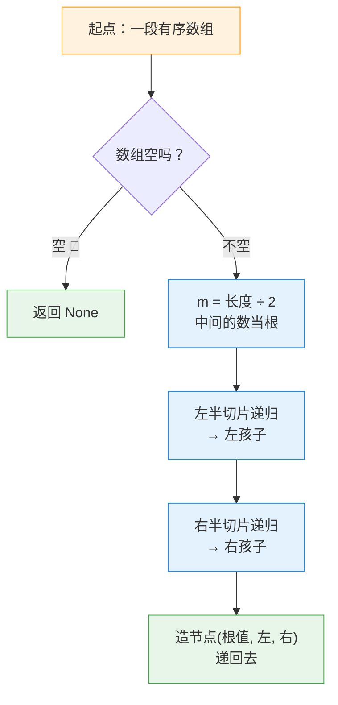

---
tags:
  - leetcode
  - 树
  - 二叉搜索树
  - 分治
  - 深度优先搜索
aliases:
  - 将有序数组转换为二叉搜索树 讲解
  - Convert Sorted Array to Binary Search Tree 讲解
difficulty: 简单
date: 2026-09-30
status: 已解决
---

# 108. 将有序数组转换为二叉搜索树 · 讲解

  -yellow?style=flat-square)

> [!info] 导航
> 📄 题目：[[将有序数组转换为二叉搜索树-题目]] ｜ 🔗 [详解：灵茶山艾府（力扣）](https://leetcode.cn/problems/convert-sorted-array-to-binary-search-tree/solutions/2927064/ru-men-di-gui-cong-er-cha-shu-kai-shi-py-inu6/)

> [!abstract] TL;DR
> 取**正中间**的数当根，左半切片递归造左子树，右半切片递归造右子树，空数组返回 `None`。有序保证"左小右大"，对半切保证"平衡"——一次全搞定。时间 O(n log n)（切片复印的开销，下标版可到 O(n)）；最大的坑：`m` 当了根就**不进任何切片**，右半从 `m + 1` 开始。

> [!info] 术语小卡片（后面看不懂的词，回来查这里）
> - **二叉搜索树（BST）**：家谱规矩——左子树全员比根小、右子树全员比根大，每棵子树都照此办理。
> - **平衡**：任何一个节点左右子树的深度差不超过 1。
> - **切片 `nums[:m]`**：复印数组的一段，规则"**含头不含尾**"——`nums[:m]` 复印到下标 m-1 为止。
> - **整除 `//`**：除完丢掉小数部分，`5 // 2 = 2`。
> - **递归基**：让递归停下来的最简单情况，本题是"空数组返回 `None`"。
> - **`TreeNode(值, 左, 右)`**：按图纸一次造出一个新节点，报三个信息——数值、左孩子、右孩子。

## 🎯 一、核心思想：切香肠，中间那片当家长

一排按个头站好的队伍（有序数组），选**正中间**的人当家长：左半排全是比他矮的（左子树），右半排全是比他高的（右子树）。每半排内部再选中间……直到某半排没人（返回 `None`）。

**为什么中间当根两个条件都满足？** 有序数组切一刀，左边必然全小于根、右边必然全大于根 → BST 白送；每次都对半分，左右两边人数最多差 1 → 每层都均匀 → 平衡白送。

```text
[-10, -3, 0, 5, 9]     取 m=2，根 = 0
     ⬙ 切两刀（m 不进切片）
[-10, -3]      [5, 9]
  根 = -3        根 = 9
  /      \       /    \
[-10]    []    [5]     []
  根=-10  None  根=5  None

        0
       / \
     -3   9
     /   /
  -10   5
```

> [!danger] 按顺序直接插会怎样
> 把 `-10` 插进去，`-3` 挂它右边，`0` 再挂右边……整棵树退化成一条**向右的斜链**——BST 是 BST，但彻底歪了。所以"有序"不能照单全收，必须**跳着选根**。



## 🚧 二、关键细节

### 细节 1：`m` 当了根，就不进任何切片

两刀的位置：`nums[:m]` 复印左边（到 m-1 为止），`nums[m+1:]` 复印右边（从 m+1 起）。中间的 `m` 已经当根了，两边都不能有它。

> [!bug] ❌ 写成 `nums[m:]`
> 根的值又被复印进右子树，右边凭空多出一个和根相同的数——题面特意说**严格递增**（没有重复数），就是在堵这个漏洞。

> [!tip] 答案为什么不唯一
> 偶数个元素时"正中间"有两个：`len(nums) // 2` 取的是**中间偏右**，取偏左同样平衡——示例 2 `[1,3]` 的两个官方答案就是这么来的。判题机验性质，不比对某一棵树。

### 细节 2：空数组返回 `None`——递归的刹车

切片越切越短，叶子旁边的半排是空的。返回 `None` 正好接在 `left/right` 上——`None` 是合法孩子，意思是"这边没孩子"。

> [!bug] ❌ 忘了刹车
> 空数组还继续 `len(nums) // 2` 选根，`nums[0]` 一查直接 `IndexError` 崩掉。

### 细节 3：切片有复印开销（进阶见文末）

每层递归都把数组**复印**一遍再切，每层花 O(n)、共 O(log n) 层，所以是 O(n log n)。想省掉复印钱，见文末进阶的下标版。

## 📜 三、完整代码（新手版 · 逐行注释）

```python
class Solution:
    def sortedArrayToBST(self, nums: List[int]) -> Optional[TreeNode]:
        # ── 刹车：递归基 ──────────────────────────────
        if len(nums) == 0:          # 空数组：这一房没人了，挂 None
            return None

        # ── 选根：正中间那个数 ────────────────────────
        m = len(nums) // 2          # 中间下标；偶数个时取"中间偏右"
        root_val = nums[m]          # 中间的数当家长：左边全比它小，右边全比它大

        # ── 分家：左右两半各自递归 ────────────────────
        left = self.sortedArrayToBST(nums[:m])       # 左半切片（不含 m）造左子树
        right = self.sortedArrayToBST(nums[m + 1:])  # 右半切片（从 m+1 起，跳过根）

        # ── 造节点：报三个信息 ────────────────────────
        return TreeNode(root_val, left, right)       # 按图纸造房：值、左孩子、右孩子
```

灵神原文写得更省字，本篇换成了新手版——逻辑一模一样，照表翻译：

> [!info] 优雅版 vs 新手版对照表
>
> | 详解常见优雅写法 | 本篇新手写法 | 意思 |
> | --- | --- | --- |
> | `if not nums:` | `if len(nums) == 0:` | 数组是空的 |
> | `return TreeNode(nums[m], left, right)` | 先 `root_val = nums[m]` 再三参造节点 | 中间的数当根，一次造好带俩孩子 |
> | `nums[:m]` / `nums[m+1:]` | 同（配"含头不含尾"口诀） | 切片复印：左到 m-1，右从 m+1 |

## 🔍 四、手动模拟

示例 1 `[-10,-3,0,5,9]`，递归拆解总览：

| 调用 | 拿到的数组 | m | 当根 | 左半切片 | 右半切片 |
| --- | --- | --- | --- | --- | --- |
| ① | `[-10,-3,0,5,9]` | 2 | **0** | `[-10,-3]` | `[5,9]` |
| ②（①的左） | `[-10,-3]` | 1 | **-3** | `[-10]` | `[]` |
| ③（②的左） | `[-10]` | 0 | **-10** | `[]` | `[]` |
| ④（③的左/右） | `[]` | — | `None` | — | — |
| ⑤（①的右） | `[5,9]` | 1 | **9** | `[5]` | `[]` |
| ⑥（⑤的左） | `[5]` | 0 | **5** | `[]` | `[]` |
| ⑦（⑤的右） | `[]` | — | `None` | — | — |

怎么"回来"的：③ 造好节点 `-10` 递回去，接在 ② 根 `-3` 的左手上；④ 的 `None` 接在 `-3` 的右手上；⑤ 同理造出 `9` 和 `5`，最后 ① 把 `-3`、`9` 接在 `0` 两边——正好是官方答案 `[0,-3,9,-10,null,5]` ✅

复杂度一句话：时间 O(n log n)——每个数都要被造进树里，切片每层还复印一遍；空间 O(log n) 是递归栈（不计返回值和切片）。

## 🧭 五、口诀 + 相关题目

> [!summary] 口诀：**中间当根，两半分家，切空挂 None**
> 1. 谁当根谁"退籍"——切片左到 `m-1`、右从 `m+1`，`m` 不进任何一边；
> 2. 空数组返回 `None` 是刹车，也是叶子旁边的合法孩子；
> 3. 有序送你 BST，对半送你平衡——中间当根一箭双雕。

- [109. 有序链表转换二叉搜索树](https://leetcode.cn/problems/convert-sorted-list-to-binary-search-tree/)：链表没法直接取中间，进阶玩法在等你
- [700. 二叉搜索树中的搜索](https://leetcode.cn/problems/search-in-a-binary-search-tree/)：练"左小右大"的走位
- [1382. 将二叉搜索树变平衡](https://leetcode.cn/problems/balance-a-binary-search-tree/)：本题反向——树歪了，搬回本题思路救它
- [95. 不同的二叉搜索树 II](https://leetcode.cn/problems/unique-binary-search-trees-ii/)：把所有可能的 BST 全造出来

---

⬅️ 题目见 [[将有序数组转换为二叉搜索树-题目]]
