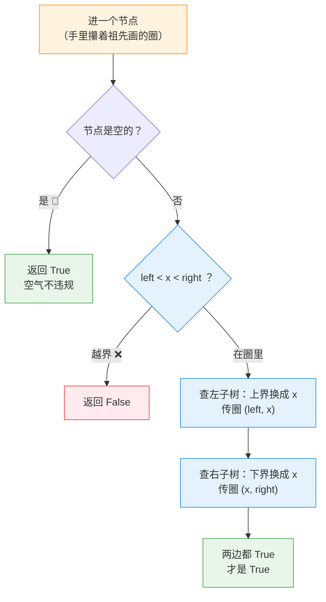

---
tags:
  - leetcode
  - 树
  - 二叉搜索树
  - 深度优先搜索
aliases:
  - 验证二叉搜索树 讲解
  - Validate Binary Search Tree 讲解
difficulty: 中等
date: 2026-09-30
status: 已解决
---

# 98. 验证二叉搜索树 · 讲解

  -yellow?style=flat-square)

> [!info] 导航
> 📄 题目：[[验证二叉搜索树-题目]] ｜ 🔗 [详解：灵茶山艾府（力扣）](https://leetcode.cn/problems/validate-binary-search-tree/solutions/2020306/qian-xu-zhong-xu-hou-xu-san-chong-fang-f-yxvh/)

> [!abstract] TL;DR
> 每个节点都被祖先画了一个**开区间**圈 `(left, right)`：进门先验 `left < x < right`（严格，不许贴线），查左子树把**上界换成自己**，查右子树把**下界换成自己**，空树返回 `True`。时间 O(n)、空间 O(n)。最大的坑：**只查每对父子**——每对父子都合法的树照样可能不是 BST。

> [!info] 术语小卡片（后面看不懂的词，回来查这里）
> - **前序遍历**：进门先办自己的事（验圈），再去找左、右孩子。
> - **中序遍历**：左子树 → 自己 → 右子树；BST 按这个顺序走一遍，值**严格递增**。
> - **后序遍历**：先孩子后自己——适合"要孩子交答案"的自底向上问题。
> - **开区间 / 严格**：`left < x < right` 两头都**不许取等**——贴线也违规。
> - **`float('-inf')`**：负无穷大，比任何数都小，天生用来当"没有边界"。
> - **`nonlocal`**：内层函数要**重新赋值**外面的变量时，必须先声明（只读不用声明）。

## 🎯 一、核心思想：家规接力，祖先画圈

题意钩子在这里收线——那棵"每对父子都合法"的树为什么假？

```text
    5          5 给右子树立规：全员必须 > 5
     \
      6        6 又给左孩子立规：必须 < 6 → 3 的圈变成 (5, 6)
     /
    3          3 进门验圈：5 < 3 ？❌ 当场出局
```

**每个节点不只受爸爸管，还受所有祖先管。** 具体化成一个工具：每人进门时手里都拿着祖先画好的**合法区间** `(left, right)`——

- 查**左**子树时：左子树全员必须 **< 我** → 把**上界换成我**，圈传 `(left, x)`；
- 查**右**子树时：右子树全员必须 **> 我** → 把**下界换成我**，圈传 `(x, right)`；
- 圈只会**越传越紧**，谁进门先验自己 `left < x < right`，越界立即 `False`。

> [!danger] ❌ 常见错法：只查每对父子
> `左孩子 < 我 < 右孩子` 每一层都查一遍——钩子树就是照这个标准"全对"却不是 BST。检查对象是**整棵子树**，不是邻居。



## 🚧 二、关键细节

### 细节 1：圈别传反——哪边收紧有讲究

查左子树收紧的是**上界**（左子树比我小的都行，但不能超过我），查右子树收紧**下界**。

> [!bug] ❌ 写反：`isValidBST(root.left, x, right)`
> 给左子树的圈下界变成了我 `x`——示例 1 里节点 1 的圈成了 `(2, +inf)`，`2 < 1` 不成立，**正确的树被判成 false**。

### 细节 2：起手的圈是无穷大——题面在暗示你

根节点没有祖先，圈应该是"不设防"。但节点值能贴到 32 位整数的两头（`-2^31 ~ 2^31-1`）：如果拿"int 最小值"当 left，根恰好取到 int 最小值时 `left < x` 就**含等了**，没法判。所以起手圈用 `±无穷`；Java 没有无穷整数才被迫升级 `long`——题面的数值范围就是在给这个坑递暗号。

### 细节 3： BST 的隐藏超能力——中序必递增

BST 按"左 → 中 → 右"走一遍，得到的值**严格递增**（正是"左小右大"的顺序展开）。反过来也成立：中序严格递增 ⇒ 是 BST。于是判 BST 变成了**判数组有序**：只需比较**相邻**两个——用 `pre` 记住"上一位"即可，连圈都不用传。证明一句话：中序里 x 左边的都已访问（含 x 的左子树，全比 x 小），右边的都没访问（含 x 的右子树，全比 x 大）。

## 📜 三、方法一 · 前序上下界（新手版 · 逐行注释）

```python
class Solution:
    def isValidBST(self, root: Optional[TreeNode],
                   left=float('-inf'), right=float('inf')) -> bool:
        # 参数：祖先画好的圈。不传时是无穷大——起手不设防（细节 2）

        # ── 刹车：空气不违规 ──────────────────────────
        if root is None:                 # 空树/空孩子：合法
            return True

        x = root.val                     # 当前节点的值

        # ── 进门先验圈：严格夹在中间，贴线也违规 ──────
        if not (left < x < right):       # 链式比较：left<x 并且 x<right
            return False

        # ── 家规接力 ─────────────────────────────────
        ok_left = self.isValidBST(root.left, left, x)    # 查左：上界换成我
        ok_right = self.isValidBST(root.right, x, right) # 查右：下界换成我
        return ok_left and ok_right      # 两房都规矩，我这里才算规矩
```

灵神原文一行 `and` 串到底，本篇拆开——逻辑一模一样，照表翻译：

> [!info] 优雅版 vs 新手版对照表
>
> | 详解常见优雅写法 | 本篇新手写法 | 意思 |
> | --- | --- | --- |
> | 默认参数 `left=-inf, right=inf` | 同（加了注释说明"起手不设防"） | 不传参数时圈是无穷大 |
> | `return left < x < right and ...` 一行串到底 | 拆成先验圈 `return False`，再算左右两房 | `and` 短路 = 先错先停 |
> | `-inf` / `inf` | `float('-inf')` / `float('inf')` | 力扣自带 `inf`；这样写哪里都能跑 |

## 🔀 四、方法二 · 中序（变量最少版）

BST 中序走一遍 = 有序表 → 比相邻。新手版用 `nonlocal` 管"上一位"：

```python
class Solution:
    def isValidBST(self, root: Optional[TreeNode]) -> bool:
        pre = float('-inf')          # 上一位的值：中序里我刚走过的那个
        def dfs(node: Optional[TreeNode]) -> bool:
            nonlocal pre             # 要重新赋值外面的 pre，必须声明
            if node is None:         # 刹车：空气合法
                return True
            if not dfs(node.left):   # 左：左子树先整队
                return False
            if node.val <= pre:      # 中：必须严格大于上一位（含等就假）
                return False
            pre = node.val           # 登记自己，当下一位的"上一位"
            return dfs(node.right)   # 右
        return dfs(root)
```

> 💡 灵神原文把 `pre` 写成类属性（`self.pre`）；新手版换成函数内变量 + `nonlocal`——正好复习那条老规矩：**重新赋值才需要 nonlocal，只读不用**。

## 🧗 五、进阶 · 方法三 · 后序（自底向上，看不懂可先跳过）

前序是把圈**带下去**；后序反过来，让孩子把整棵子树的 `(最小值, 最大值)` **报上来**，我拿它验自己：`x` 必须比左子树的最大值大、比右子树的最小值小。

```python
class Solution:
    def isValidBST(self, root: Optional[TreeNode]) -> bool:
        def dfs(node: Optional[TreeNode]):
            if node is None:                     # 空树报 (inf, -inf)：min 给最大、max 给最小，
                return float('inf'), float('-inf')   # 谁跟它比都不受干扰
            l_min, l_max = dfs(node.left)        # 左子树报数
            r_min, r_max = dfs(node.right)       # 右子树报数
            x = node.val
            if x <= l_max or x >= r_min:         # 我得比左边全家大、右边全家小
                return float('-inf'), float('inf')   # 坏了！报"毒区间"，让祖先验圈必炸
            return min(l_min, x), max(r_max, x)  # 把整棵子树的最小/最大如实上报

        _, r_max = dfs(root)
        return r_max != float('inf')             # 根没报毒区间 = 全树合法
```

坏消息怎么往上传？坏了就返回 `(-inf, inf)`——任何祖先拿它验自己都必炸，"坏"一路毒上去，最后看根有没有报毒。

## 🔍 六、手动模拟

钩子树 `[5,1,6,null,null,3,7]`，方法一（前序画圈）：

| 调用 | 节点 | 进门时的圈 | `left < x < right`？ | 结局 |
| --- | --- | --- | --- | --- |
| ① | 5 | `(-inf, +inf)` | ✓ | 去查左：① → ② |
| ② | 1 | `(-inf, 5)` | ✓ | 两孩子皆空 → `True` |
| ① | 5 | — | — | 左房规矩 ✓，去查右：③ |
| ③ | 6 | `(5, +inf)` | ✓ | 去查左：④ |
| ④ | 3 | `(5, 6)` | `5 < 3`？❌ | **返回 False，当场拦下** |

④ 的圈怎么来的：**下界 5 是爷爷给的，上界 6 是爸爸给的**——受所有祖先管，一眼现形。官方示例 2（`5,1,4,...` 里 4 进 5 的右子树，圈 `(5,+inf)` 直接越界）同理判 `False` ✅ 按规则推演与预期一致。

复杂度一句话：时间 O(n)——每节点验一次；空间 O(n)——最坏退化成一条链，递归栈站满。

## 🧭 七、口诀 + 相关题目

> [!summary] 口诀：**进门先验圈，左传上界右传下界，空树天然合法**
> 1. 圈是祖先接力画的，只会越传越紧；查左换上界、查右换下界，**传反就误判**；
> 2. 严格不等：贴线也算违规；起手圈用 ±无穷，别用 int 边界硬凑；
> 3. 方法二口诀：**中序一路走，必须一路涨，pre 记上一位**。
>
> 灵神点评三连：**前序最快**（越界可当场返回，不用走到叶子）、**中序变量最少**（吃透 BST 性质）、**后序最通用**（自底向上报答案——[[二叉树的直径-讲解|543 树形 DP]]"左右各要一条链"就是它亲戚，动态规划的入场券）。

- [230. 二叉搜索树中第 K 小的元素](https://leetcode.cn/problems/kth-smallest-element-in-a-bst/)：中序递增的直接应用
- [530. 二叉搜索树的最小绝对差](https://leetcode.cn/problems/minimum-absolute-difference-in-bst/)：同款 `pre` 比相邻套路
- [700. 二叉搜索树中的搜索](https://leetcode.cn/problems/search-in-a-binary-search-tree/)：练"左小右大"走位
- [1382. 将二叉搜索树变平衡](https://leetcode.cn/problems/balance-a-binary-search-tree/)：98+108 串烧——验出歪树再重造

---

⬅️ 题目见 [[验证二叉搜索树-题目]]
