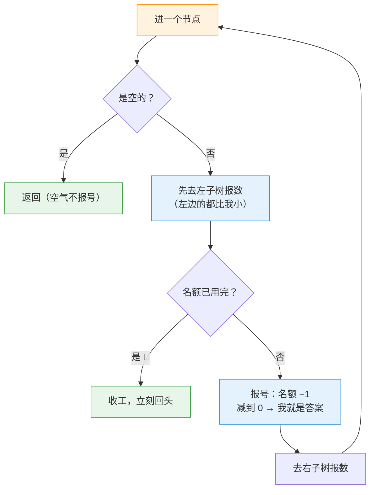

---
tags:
  - leetcode
  - 树
  - 二叉搜索树
  - 中序遍历
  - 深度优先搜索
aliases:
  - 二叉搜索树中第K小的元素 讲解
  - Kth Smallest Element in a BST 讲解
difficulty: 中等
date: 2026-09-30
status: 已解决
---

# 230. 二叉搜索树中第 K 小的元素 · 讲解

  -yellow?style=flat-square)

> [!info] 导航
> 📄 题目：[[二叉搜索树中第K小的元素-题目]] ｜ 🔗 [详解：Krahets（力扣）](https://leetcode.cn/problems/kth-smallest-element-in-a-bst/solutions/2361685/230-er-cha-sou-suo-shu-zhong-di-k-xiao-d-n3he/)

> [!abstract] TL;DR
> [[验证二叉搜索树-讲解|98 题]]的定理直接变现：**BST 中序遍历 = 严格递增序列**，所以"第 k 小"就是**中序报到的第 k 个人**。开一个全递归共享的记分牌，报到一个名额减一，**减到 0 的节点就是答案**；之后所有进门的节点看一眼记分牌就回头（剪枝）。时间 O(N)、空间 O(N)（链状树最坏）。最大的坑：记分牌必须**全递归共享**——忘写 `nonlocal` 直接 `UnboundLocalError`。

> [!info] 术语小卡片（后面看不懂的词，回来查这里）
> - **中序遍历**：左子树 → 自己 → 右子树；BST 按此走一遍 = 从小到大排队。
> - **记分牌（共享状态）**：递归各层共用的一个变量——这里就是"还剩几个名额"。
> - **剪枝**：发现再走下去不会有新收获，提前回头，省掉白走的路。
> - **`nonlocal`**：内层函数要**重新赋值**外面的变量时必须先声明（只读不用）。

## 🎯 一、核心思想：中序队伍，报号收工

题意钩子的答案：让全树按中序**排队报号**，报到第 k 个喊"到"，**后面的队不用排了**。

```text
        3            中序队伍：① 1   ② 2   ③ 3   ④ 4
       / \           k = 1 → 轮到 ① 报号，答案就是 1
      1   4          而 ① 站定后，② ③ ④ 全部不用出场
       \
        2
```

三样工具：**记分牌**（还剩几个名额，开局 = k）、**报号**（每遇到一个节点，名额减一）、**收工铃**（名额归零后，谁进门谁立刻回头）。



## 🚧 二、关键细节

### 细节 1：记分牌必须全递归共享——`nonlocal` 是命根子

`count` 只有一个，所有递归层减的都是**同一个**。忘了声明 `nonlocal`，`count -= 1` 这种重新赋值会让 Python 以为你想造一个局部变量——当场 `UnboundLocalError`。

> [!bug] 实战提醒
> 这正是老坑清单里那条"**`nonlocal` 只在重新赋值时需要**"的现身说法：只读外层变量不用声明，`count -= 1` 和 `res = ...` 都是重新赋值，必须声明。

### 细节 2：剪枝是"全员下班铃"，不是"找答案的机关"

`if count == 0: return` 放在报号**之前**——找到答案之后它的任务是让**所有还在路上的递归**立刻回头。少了它答案照样对（一直数下去第 k 个不会变），但整棵树会被白走一遍。

> [!tip] 剪枝省多少
> k = 1 且根有左子树时：走到最左下角拿完答案就收工，右半边整棵子树**一次都不进**。最坏情况（树是链状）才退化为 O(N)。

### 细节 3：报号和找答案是同一步——"减到 0 的就是我"

先 `count -= 1` 再查 `count == 0`：**第 k 个被访问的节点**减完正好归零，当场登记 `res`。顺序不能倒——先查再减会把答案错位成第 k+1 个。

## 📜 三、完整代码（新手版 · 逐行注释）

```python
class Solution:
    def kthSmallest(self, root: Optional[TreeNode], k: int) -> int:
        # ── 开局：记分牌 ──────────────────────────────
        count = k                    # 剩余名额：报到一人减一个
        res = None                   # 答案：第 k 个报号人的值

        def dfs(node: Optional[TreeNode]) -> None:
            nonlocal count, res      # 要重新赋值外面的变量，先声明（细节 1）
            if node is None:         # 刹车：空气不参与报号
                return
            dfs(node.left)           # 左：比我都小的先报
            if count == 0:           # 下班铃：答案已定，谁进门谁回头（细节 2）
                return
            count -= 1               # 我报一个号
            if count == 0:           # 减到 0：第 k 个就是我（细节 3）
                res = node.val
            dfs(node.right)          # 右：轮到比我大的

        dfs(root)
        return res
```

Krahets 原文把记分牌挂在 `self.k` 上，本篇换成内层函数 + `nonlocal`——逻辑一模一样，照表翻译：

> [!info] 优雅版 vs 新手版对照表
>
> | 详解常见优雅写法 | 本篇新手写法 | 意思 |
> | --- | --- | --- |
> | `self.k = k` 挂在实例上传状态 | 函数内 `count` + `nonlocal count` | 全递归共用的记分牌 |
> | `if not root: return` | `if root is None: return` | 空节点刹车 |
> | `self.k -= 1` 后紧跟 `if self.k == 0: self.res = root.val` | 同（拆开注明"报号→归零→登记"） | 第 k 个报号人就是答案 |
> | 一行 `and` / 紧凑 if | 拆成独立行 + 注释 | 每行只干一件事 |

## 🔍 四、手动模拟

示例 1 `root = [3,1,4,null,2]`，`k = 1`（count 开局 1）：

| 步 | 动作 | count | 说明 |
| --- | --- | --- | --- |
| 1 | 进 3 | 1 | 先下左：比 3 小的先报 |
| 2 | 进 1（3 的左） | 1 | 1 的左边是空 |
| 3 | 空 → 刹车 | 1 | 返回到 1 |
| 4 | **报号 @1** | 1 → 0 | 归零！`res = 1` 🎯 |
| 5 | 进 2（1 的右） | 0 | 被迫走完这段 |
| 6 | 2 的左空 → 刹车 | 0 | — |
| 7 | **报号位 @2** | 0 | 下班铃！立刻回头 |
| 8 | 回到 3 的报号位 | 0 | 下班铃！回头 |
| 9 | **3 的右子树（4）从未进队** | — | 剪枝实锤 ✅ |

按规则推演：输出 `1`，与官方示例一致 ✅ 复杂度一句话：时间 O(N)（链状树最坏）；空间 O(N)——递归栈深度最坏也是 N。

## 🧭 五、口诀 + 相关题目

> [!summary] 口诀：**中序排队报号，减到零就是我；名额一满，全员回头**
> 1. 记分牌全递归共用一份——重新赋值必写 `nonlocal`；
> 2. 先减一、再查零：归零的那位就是第 k 个；
> 3. 剪枝是省路费的，不是找答案的——不加也对，加了不白走。

- [剑指 Offer 54. 二叉搜索树的第 k 大节点](https://leetcode.cn/problems/er-cha-sou-suo-shu-de-di-kda-jie-dian-lcof/)：把中序反过来（右→中→左），第 k 大
- [173. 二叉搜索树迭代器](https://leetcode.cn/problems/binary-search-tree-iterator/)：中序"走一步停一步"的迭代玩法，进阶方向的垫脚石
- [98. 验证二叉搜索树](https://leetcode.cn/problems/validate-binary-search-tree/)：中序递增定理的出处，两题连读

> 💡 题面进阶（频繁插入/删除 + 频繁查第 k 小）的思路：给每个节点记一本"**左子树人数**"账——查第 k 小时比一比账面，小于 k 往右、大于 k 往左，每次 O(树高)；插入删除顺手维护账本。这本质是给树"记分牌长在树上"，对应高级结构"平衡树 + 子树大小"。

## 📚 参考资料

- 🎬 **配套互动页面**：同文件夹的 `第K小-报号大厅.html`——双击用浏览器打开：选 k、单步/自动播放，看中序报号、记分牌归零、下班铃剪枝的全过程，附同步代码高亮和小测验
- [230. 二叉搜索树中第 K 小的元素题解 · Krahets（力扣）](https://leetcode.cn/problems/kth-smallest-element-in-a-bst/solutions/2361685/230-er-cha-sou-suo-shu-zhong-di-k-xiao-d-n3he/)——本篇讲解的骨架来源

---

⬅️ 题目见 [[二叉搜索树中第K小的元素-题目]]
