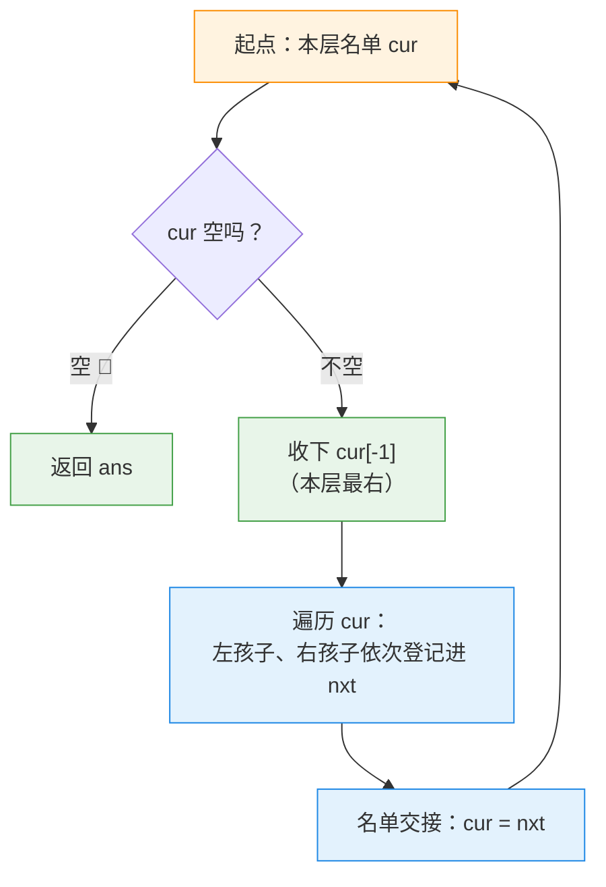

---
tags:
  - leetcode
  - 树
  - 二叉树
  - 广度优先搜索
  - 深度优先搜索
aliases:
  - 二叉树的右视图 讲解
  - Binary Tree Right Side View 讲解
difficulty: 中等
date: 2026-09-30
status: 已解决
---

# 199. 二叉树的右视图 · 讲解

  -yellow?style=flat-square)

> [!info] 导航
> 📄 题目：[[二叉树的右视图-题目]] ｜ 🔗 [详解：灵茶山艾府（力扣）](https://leetcode.cn/problems/binary-tree-right-side-view/solutions/2015061/ru-he-ling-huo-yun-yong-di-gui-lai-kan-s-r1nc/)

> [!abstract] TL;DR
> 右视图 = **每一层最右的节点**，从上到下。BFS 版：整层名单换班（`cur` → `nxt`），开轮先收下 `cur[-1]`（名单最后一位 = 最右）；DFS 版：**先递归右子树再递归左子树**，`depth == len(ans)` 说明这个深度**第一次**有人到——第一个到的一定是最右。时间都是 O(N)；空间 BFS 是 O(N)（最宽一层）、DFS 是 O(h) 递归栈。最大的坑：名单登记顺序必须**左先右后**，反了答案就变左视图。

> [!info] 术语小卡片（后面看不懂的词，回来查这里）
> - **右视图**：从右边看树，每层只露出最右一个节点。
> - **名单制 BFS**：不做"叫号"，改用两张名单——`cur` 装本层全部节点，`nxt` 装下一层；一轮结束整班交接。
> - **负下标 `-1`**：Python 里 `cur[-1]` 是列表最后一个元素，`cur[0]` 是第一个。
> - **已解锁层数**：`len(ans)` 等于目前已经记录了几层——它是方法二判断"这个深度是不是第一次到"的尺子。

## 🎯 一、核心思想：视角一转，就是排队报号的限定版

[[二叉树的层序遍历-讲解|102]] 的层序遍历是"每层全员报号"；本题只要**每层队伍的最后一个人**——站右边能看见的那个。

灵神给出了两条完全不同的路，殊途同归：

**方法一（BFS 名单制）**：不开叫号队，改用**两张名单换班**。`cur` 是本层花名册，开轮先收下**名册末位**（`cur[-1]`，最右），然后把所有人的孩子登记进 `nxt`，一轮结束名单交接。

**方法二（DFS 先右后左）**：正常 DFS 是左先右后；**故意反过来，先右后左**——这样每层**第一个到达的节点必定是最右**。怎么判断"我是不是第一个到的"？带一个 `depth`，`depth == len(ans)` 就是"这个深度还没人登记过"。

```text
示例 2：[1,2,3,4,null,null,null,5]

    1 ←─ 收 1      每层最右：
   / \             第 0 层：1
  2   3 ←─ 收 3    第 1 层：3（2 被挡）
  /                第 2 层：4
 4    ←─ 收 4      第 3 层：5（整层只有它，最左也能进答案）
 /
5    ←─ 收 5
```



## 🚧 二、关键细节

### 细节 1：名单登记顺序——左先右后，末位才是最右

`nxt` 的顺序就是下一层的从左到右。**先登记左孩子、再登记右孩子**，`nxt[-1]`（下一轮的 `cur[-1]`）才是最右。

> [!bug] ❌ 反着登记（先右后左）
> 名单顺序整个反过来，`cur[-1]` 变成每层**最左**——输出的是**左视图**。方法二反而是故意用"先右后左"，两种方法在这里正好相反。

### 细节 2：方法二的"双机关"缺一不可

- **先右后左**：保证每层第一个到达的是最右；
- **`depth == len(ans)`**：`len(ans)` 是"已解锁层数"。相等 = 这个深度**第一次**有人到 → 收下；不相等 = 该层已经有代表 → 跳过。
- ❌ 改成先左后右：第一个到的是最左，答案变左视图（这恰好就是 [513 找左下角](https://leetcode.cn/problems/find-bottom-left-tree-value/)一类的思路源头）。

### 细节 3：空树——两种方法的待遇不同

方法一 `cur = [root]` 前必须特判：`root` 是 `None` 还放进名单，`cur[-1].val` 当场崩。方法二天然免疫：`dfs(None, 0)` 第一行就刹车，`ans` 空着返回，正好是 `[]`。

> [!tip] 灵神的注解：另一种名单玩法
> 把**右孩子先**登记进 `nxt`，名单顺序就变成"从右到左"，`cur[0]`（第一位）成了最右——收 `cur[0]` 即可。和细节 1 是同一枚硬币的两面。

## 📜 三、方法一 · BFS 名单制（新手版 · 逐行注释）

```python
class Solution:
    def rightSideView(self, root: Optional[TreeNode]) -> List[int]:
        # ── 刹车：空树没有视野 ─────────────────────────
        if root is None:                 # 空树特判（细节 3）
            return []

        # ── 名单制 BFS：cur 本层名单，nxt 下层名单 ─────
        ans = []                         # 答案：每层最右的值，从上到下
        cur = [root]                     # 第 0 层只有根一个人

        while cur:                       # 本层名单还有人，就还有下一层
            ans.append(cur[-1].val)      # 开轮先收末位：cur[-1] 就是本层最右（细节 1）
            nxt = []                     # 下层名单：开一张新纸
            for node in cur:             # 逐个过本层名单
                if node.left is not None:    # 左孩子先登记（细节 1）
                    nxt.append(node.left)
                if node.right is not None:   # 右孩子后登记
                    nxt.append(node.right)
            cur = nxt                    # 名单交接：下层升成本层

        return ans                       # 名单空了，视野收完
```

灵神原文已算好写，本篇只补注释，照表对照：

> [!info] 优雅版 vs 新手版对照表
>
> | 详解常见优雅写法 | 本篇新手写法 | 意思 |
> | --- | --- | --- |
> | `if node.left:` | `if node.left is not None:` | 真有左孩子才登记 |
> | `cur[-1].val` | 同（注释"负下标 = 末位"） | `-1` 是列表最后一个元素 |
> | `if root is None: return []` | 同（加"空树特判"注释） | 方法一必须特判空树 |

## 🔀 四、方法二 · DFS 先右后左（新手版）

```python
class Solution:
    def rightSideView(self, root: Optional[TreeNode]) -> List[int]:
        ans = []                         # len(ans) = 已解锁层数

        def dfs(node: Optional[TreeNode], depth: int) -> None:
            # depth：我站在第几层（根是第 0 层）
            if node is None:             # 刹车：空树天然返回 []（细节 3）
                return
            if depth == len(ans):        # 这个深度第一次有人到（细节 2）
                ans.append(node.val)     # 先右后左，第一个到的必是最右
            dfs(node.right, depth + 1)   # 先右：抢下"本层第一到"
            dfs(node.left, depth + 1)    # 后左：同层的左边的都会被跳过

        dfs(root, 0)
        return ans
```

## 🔍 五、手动模拟

示例 2 `[1,2,3,4,null,null,null,5]`（就是题意阶段说"最左的 5 也能进答案"的那棵）。

**方法一（名单换班）**：

| 轮 | cur（本层名单） | 收下 | 生成 nxt |
| --- | --- | --- | --- |
| 1 | `[1]` | 1 | `[2, 3]` |
| 2 | `[2, 3]` | 3 | `[4]` |
| 3 | `[4]` | 4 | `[5]` |
| 4 | `[5]` | 5 | `[]` |
| — | `[]` 队空收工 | — | `ans = [1,3,4,5]` ✅ |

**方法二（先右后左）**：

| 到访序 | 节点 | depth | len(ans) | 动作 |
| --- | --- | --- | --- | --- |
| 1 | 1 | 0 | 0 | 首次到达 → 收下 1 |
| 2 | 3 | 1 | 1 | 首次到达 → 收下 3 |
| 3 | 2 | 1 | 2 | 第 1 层已解锁 → 跳过 |
| 4 | 4 | 2 | 2 | 首次到达 → 收下 4 |
| 5 | 5 | 3 | 3 | 首次到达 → 收下 5 |

两法输出一致：`[1,3,4,5]`，与官方示例 2 一致 ✅ 复杂度一句话：时间都是 O(N)；空间方法一 O(N)（最宽一层名单），方法二 O(h)（递归栈，链状树最坏 O(N)）。

## 🧭 六、口诀 + 相关题目

> [!summary] 口诀：**BFS 名单末位最右，DFS 先右后左解锁新层**
> 1. 名单登记**左先右后**，`cur[-1]` 才是最右——反了就是左视图；
> 2. 方法二两机关：先右后左 + `depth == len(ans)` 判"首次到达"；
> 3. 空树：方法一要特判，方法二天然返回 `[]`。

- [102. 二叉树的层序遍历](https://leetcode.cn/problems/binary-tree-level-order-traversal/)：母题，名单制的完整版
- [513. 找左下角的值](https://leetcode.cn/problems/find-bottom-left-tree-value/)：对偶题——把"先右后左"反过来就是它
- [637. 二叉树的层平均值](https://leetcode.cn/problems/average-of-levels-in-binary-tree/)：同样是每层挑东西，挑的是平均数

---

⬅️ 题目见 [[二叉树的右视图-题目]]
